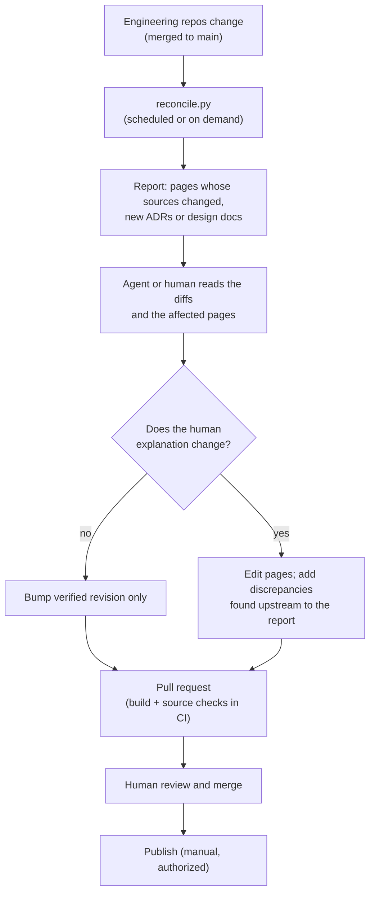

# About this documentation

This site is a **human-facing presentation layer** over the Avrana Party engineering
repositories. Those repositories are optimized for coding agents and for the engineer directing
them: dense, exhaustively cross-referenced, and with every claim scoped and dated. This site
explains the same system to a person meeting it for the first time.

## The engineering repositories are authoritative

This site is never the authority for a technical contract, a security guarantee, an
implementation requirement or an architectural decision. When it states one, it is
paraphrasing a source in the engineering repositories and links to it. If this site and those
sources disagree, the sources win, and the disagreement is a bug in this site, or occasionally
a [discrepancy](../status/discrepancies.md) to report upstream.

In particular:

- **Contracts are not copied here.** Protocol message tables, JSON schemas and exact
  configuration change often. This site explains what they are for and links to them.
- **Live work is not tracked here.** Linear owns it. The [status](../status/index.md) page is a
  dated snapshot.
- **This site grants no permission.** Nothing here authorizes a deployment, a change to a
  contract or work on a roadmap item.

## Maturity labels

Every claim about capability is labelled with one of these:

--8<-- "includes/maturity-labels.md"

Where evidence is missing or contested, the page says so in words rather than choosing the more
flattering label.

## Source revisions

This version of the site was reconciled against the revisions below. The table is generated
from `sources.yml` at the root of the documentation repository, which is the only place they are
recorded.

<!-- source-revisions -->

Linear was consulted read-only for the [status](../status/index.md) snapshot. No tool can check
Linear, so the status page carries its own date and a staleness warning in the source check.

## How each page is traced

Every page carries front matter listing the engineering files it explains:

```yaml
---
title: The Party
sources:
  - avrana-party:avrana/party/core.py
  - avrana-party:docs/adr/0011-party-console-model.md
verified: 2026-10-09
---
```

The build turns that list into the collapsed **Canonical sources** block at the foot of every
page, so readers can see what a page explains and when it was last checked. Two tools in the
documentation repository also use it:

- **`tools/check_sources.py`** fails the build if a listed source file, or a link into an
  engineering repository, no longer exists. It also reports pages without sources.
- **`tools/reconcile.py`** compares each engineering repository's recorded revision with its
  current `main`. It lists every page whose sources changed, with links to the changes. Files a
  page links to in its text count as sources too. It also flags new ADRs, design documents,
  dated findings and game contracts that no page covers yet.

## The reconciliation workflow

Engineering changes daily. The human-facing explanation should change much less often, but it
must not quietly drift. The intended loop is:



The scheduled job only **produces a report**. It never edits pages, opens commits or publishes.
An AI agent can be pointed at that report to *propose* updates as a pull request. A human
reviews every change before it merges, and publishing is a separate, manual step. The
repository's `CONTRIBUTING.md` gives the step-by-step procedure and a ready-to-use agent prompt.

### What counts as a reason to update

- A capability changes maturity: deployed, merged, accepted, retired.
- A new ADR, or an amendment that changes a decision explained here.
- A contract changes in a way that alters the explanation, not just the details.
- New evidence: a dated finding, especially real-phone evidence.
- A discrepancy listed here is resolved upstream.

Changes that are only volatile detail, such as a renamed function or a new test, need no prose
change. They need only the verified revision bumped once a person has looked.
