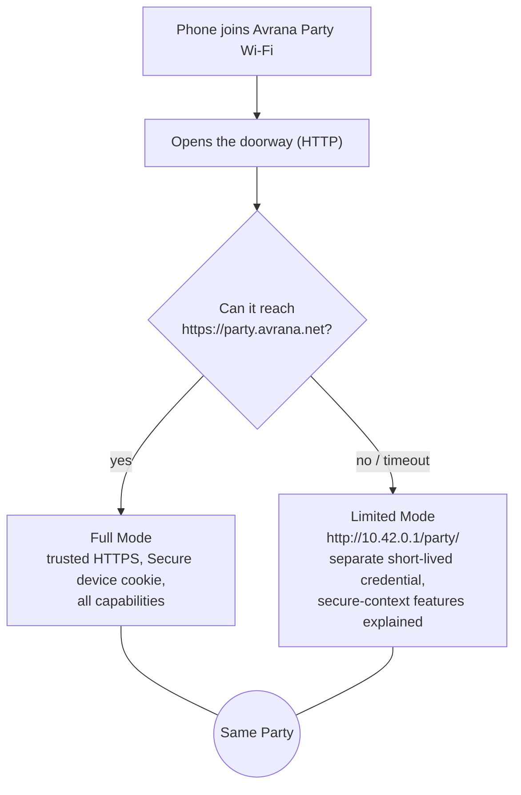

# The appliance and its network

The appliance has a simple job: become a small, private internet for one room. This page
follows a phone from the moment it sees the Wi-Fi network to the moment it loads Party Home,
and explains the decision behind each step.

## The hardware

Deployed The appliance is a **Raspberry Pi 4** running
Debian 13. It uses its built-in Wi-Fi radio as the access point. For development and
maintenance it is also connected over wired Ethernet to the owner's home network. Players
never use that wired link.

Power has shaped the hardware more than anything else. Early on, an extra USB Wi-Fi adapter
caused repeated under-voltage events, even with a new power supply. After the adapter was
removed on 2026-09-24, a baseline of 3 hours 26 minutes covering idle, CPU and radio load recorded no
under-voltage at all. The engineering notes are careful about the limits of that result. It
does not cover many active phones, long play sessions, the emulator streaming to several
viewers, cold boots or battery power. Those measurements belong to the
[appliance readiness](../project/roadmap.md#appliance-readiness) work.

## Joining the Wi-Fi

Deployed The Pi's radio runs a WPA2 access point
managed by NetworkManager. Its network name is **Avrana Party**, it uses the 5 GHz band and the
appliance's address is `10.42.0.1`. NetworkManager's built-in `dnsmasq` hands out addresses and
answers DNS for connected phones. The engineering notes cite a client limit of about eight
phones for the built-in radio, but it has not been measured.

The DNS configuration does three jobs:

1. **Answers captive-portal probes.** When a phone joins Wi-Fi, it checks whether the network
   has internet by fetching a known address from Apple, Google or Microsoft. The appliance
   points those hostnames at itself. Apple's probe gets the exact "Success" page it expects, so
   an iPhone joins quietly instead of opening the sign-in mini-browser. Other platforms'
   probes currently receive a 404.
2. **Resolves the Party's name locally.** `party.avrana.net` resolves to `10.42.0.1`, but only on
   this network. Public DNS has no address for it.
3. **Advertises `party.local`** over mDNS (Avahi) as a convenience name.

## Trusted HTTPS with no internet

Deployed since 2026-09-25. Phones load the Party from
`https://party.avrana.net/party/`, and the browser trusts the connection without any warning.
[Why phones, and only phones](../introduction/phone-first.md#no-internet-required) explains why
this matters. The mechanics are:

- The appliance holds a **public Let's Encrypt certificate** for `party.avrana.net`, issued
  through the ACME DNS-01 challenge. The private key and the ACME account stay on the Pi. No
  phone needs a private certificate authority.
- Because the name resolves to the appliance only on the Party network, a phone there reaches
  the box at a hostname that matches a certificate it already trusts. It can validate that
  certificate without going online.
- The certificate expires every 90 days. Renewal needs a brief internet connection through the
  wired port and a scoped DNS API token. The renewal script and timer exist but are **not
  enabled**, so renewal is a manual step today. The current certificate is valid until
  2026-12-25. Automatic renewal is tracked as open work.

!!! info "No HSTS, ever"

    The site deliberately never sends an HTTP Strict Transport Security header. HSTS would make
    browsers refuse plain HTTP to this hostname for a long time. An expired certificate would
    then lock players out completely. Leaving HSTS off is what keeps the
    [Limited Mode](#full-mode-and-limited-mode) escape route open.

## The front door: nginx

All traffic from phones goes through **nginx**. On port 443 (`party.avrana.net`):

| Path | Goes to | Status |
|---|---|---|
| `/party/` | The Party Home web app: static files from a versioned release directory | Deployed |
| `/party/api/` | Party Core on `127.0.0.1:8191`, including 25-second long polls | Deployed |
| `/games/bluff/` | The games server (the LAN Games fork) on `127.0.0.1:8096` | Deployed |
| `/games/expo/` | The same games server, for EXPO | In source: EXPO's Party contract entered source after the verified deployment, and the appliance had no EXPO session key on 2026-10-03 |
| `/arcade/` | The arcade stream service on `127.0.0.1:8097` | Deployed |
| `/party/api/origin.json` | Answered by nginx itself, so a page can test whether the HTTPS Party is reachable | Deployed |
| `/games/<slug>/` | A native game's own Unix socket, `/run/avrana-games/<slug>.sock` | In source |
| `/games/*/avrana/` | Refused: these are the games' control endpoints, reachable only from the appliance itself | In source |
| `/` exactly | Redirect to `/party/` | In source |
| Any other path | The games server on `127.0.0.1:8096`: the shared assets, avatars, chat and APIs that BLUFF and EXPO still load from the LAN Games runtime | Deployed · Retiring |

**Port 80**, plain HTTP, serves more than captive-portal answers. It also proxies `/arcade/`,
BLUFF and EXPO under `/games/`, and every other path to the games server, so those games can
still be reached without HTTPS. In source, `/` on port 80 is a small page that links to the
HTTPS Party, and no native game is served there. Port 80 never issues a blanket redirect to
HTTPS, because a redirect would break the captive probes and Limited Mode.

In source, nginx no longer exposes the other LAN Games titles or the old LAN Games hub page,
because that runtime is [retiring](../games/execution-models.md#the-lan-games-fork). The
deployed appliance predates that change and still serves them, with the hub at `/` on port 80.

The two nginx configuration files in the repository (`avrana-party.nginx` and `arcade/nginx-site`)
must stay byte-identical. CI checks this, and CI also runs real nginx against the committed
site file in its simulated-appliance tests.

## Full Mode and Limited Mode

Accepted direction · partly
In source · not deployed

Trusted HTTPS can fail in ordinary ways. The certificate can expire, since the Pi has no
battery-backed clock and may boot with the wrong date. A phone may use private DNS, a VPN or
iCloud Private Relay, so the local name never resolves. A guest may type the address without
`https://`. Today, any of these leaves that phone without Party Home.

The project decided ([ADR 0012](../decisions/0012-limited-mode-party-survives-https-loss.md))
that **losing trusted HTTPS must not disable the Party**. There are two consumer-facing modes of
one Party:

- **Full Mode** is the Party over trusted HTTPS. It is the default and the preferred experience.
- **Limited Mode** is the same Party over plain HTTP at the appliance's IP address. Membership,
  presence, the host, navigation and compatible games keep working. Features that need a secure
  context are explained or unavailable for that phone only: wake lock, the offline copy, and
  games that declare they need one. The page says plainly that the connection is not secure.

The design starts every phone at a small HTTP **doorway** page. The doorway tries to reach the
HTTPS Party in the background. If that works, it sends the phone to Full Mode. If it fails or
times out, it sends the phone to Limited Mode at `http://10.42.0.1/party/`, because an IP
address is the only route that survives a DNS override.

Identity is the hard part. The Full Mode device cookie is `Secure` and is never weakened to
work over HTTP. So Limited Mode issues its own short-lived credential, and a phone that switches
modes may appear as a new member. The interface says so instead of guessing.

The current state in source is a second, Limited-Mode listener inside Party Core, its separate
credential, the doorway page and host succession that prefers Full Mode members. All of it is
tested in simulation. Two steps are still open: the nginx routes that would expose Limited Mode
on port 80, and real-phone validation. Game pages also do not yet follow the Party in Limited
Mode.

## Offline copy

Deployed In Full Mode, Party Home registers a service
worker scoped to `/party/`. It fetches from the network first for everything, so a phone on
the Party network always runs the current build. The cached copy is used only when the Pi
cannot be reached, and the page then says so. Party state, identity and the APIs are never
cached. The project treats this copy as a convenience, not a recovery mechanism. Limited Mode
is the recovery mechanism. There are three kill switches, from gentle to drastic: a version
flag, a self-destructing worker build and a manual "Remove offline copy" button.

## Operations at a glance

People deploy; agents build and test the deployment machinery and never run it against the
appliance. The current tooling is:

- Deployed `ops/install-party-web.sh` builds a Party
  Home release from a clean checkout, switches to it atomically, keeps the last five releases
  and can roll back.
- In source `ops/deploy.sh` deploys explicit,
  reviewed commits of both repositories, restarts only what changed, runs smoke checks, writes
  a deployment manifest on the Pi and rolls back on failure. It has not been run in production
  yet.
- In source `/party/api/status` reports which revisions
  are deployed, service states, how many days the certificate has left and overall health. It
  is the intended authority for "what is running".
- In source A rebuild runbook and appliance inventory
  describe how to build a fresh appliance. That procedure has been rehearsed only on a
  simulated host.

See [Deployed system and history](../project/system-map.md) for the verified deployed topology, and
[Deployment](../project/deployment.md) for how a release reaches the appliance.

## Where to read more

- [Limited Mode](../design/limited-mode.md): the full design for keeping the Party alive when
  trusted HTTPS fails.
- [ADR 0012](../decisions/0012-limited-mode-party-survives-https-loss.md): why Full Mode and
  Limited Mode exist.
