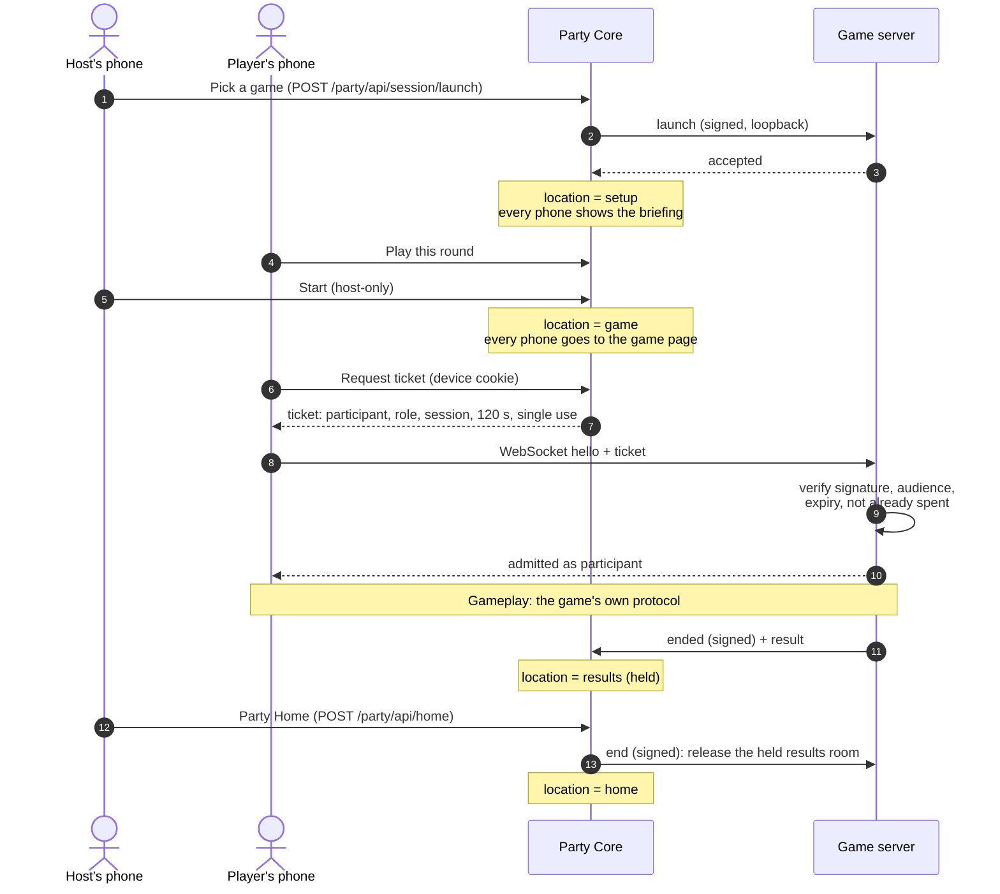

# Game sessions

A **game session** is one launch of one game inside the Party. The session protocol
(`avrana.party-session/v0`, [ADR 0006](../decisions/0006-party-session-protocol.md))
is the interface between Party Core and a game server. It deliberately covers very little:
starting a session, admitting the right people, ending the session and learning the outcome.
Everything that happens during play is the game's own business.

The protocol has been Deployed since 2026-09-29 for
BLUFF, and for launching and ending the arcade. Later additions are
In source only: single-use tickets, result reporting and
ticket admission to arcade controllers.

## The protocol's three ideas

**1. Signed messages, one key per game.** Every protocol message is a small JSON payload signed
with HMAC-SHA256 and written as `aps0.<payload>.<signature>`. Each game has its own 32-byte key,
shared only by Party Core and that game. Messages name their sender, audience, session and
purpose, expire after 30 seconds and carry a nonce so that a replayed message is rejected.

The project chose symmetric keys on purpose. Both parties sit on the same appliance, so a
public-key scheme would add complexity without adding protection for session traffic.
Public-key signatures are reserved for a future need where they do help: proving where a
game package or software update came from.

**2. Tickets admit people.** A phone does not tell a game who it is. It asks Party Core for a
**ticket**: a signed capability that says *this connection is participant P, with role R, in
session S of game G*. It presents the ticket as the first message on its WebSocket to the game.
The game verifies the signature, the audience and the expiry, then admits the connection as
that participant. Tickets live for at most 120 seconds and are **single-use**. A reconnecting
phone fetches a fresh ticket, which carries the same participant id, so the game sees the same
person return.

**3. The game reports the end.** Only the game knows when its rules say a round is over. When
that happens, the game sends a signed **`ended`** message back to Party Core over a local-only
route, optionally with a structured result. Party Core does not decide outcomes. It records
them.

## A round, end to end

A few details are worth calling out:

- **Launch can fail cleanly.** If the game does not accept a launch within 60 seconds, the
  session is closed as `launch_failed`. If a launch succeeds after the Party has already given
  up on it, the Party ends it at the game, so nothing is left running unattended.
- **Switching games is end-then-launch.** If the host picks a different game during a round,
  the current session is ended at the game before the next one launches.
- **Ending has a deadline.** If a game does not confirm an end within 15 seconds, Party Core
  stops waiting and records why.
- **Outcomes are a small fixed set**: `completed`, `abandoned`, `ended_by_host` and
  `launch_failed`. Only `completed` holds the results screen.

## What a game learns about a player

Very little, by design. A game learns:

- a **participant id**, random and issued for this session only;
- a **role** (player or spectator);
- a **display name** to show, which arrives in the roster sent with `launch`, not in the
  ticket;
- a derived per-participant **game token**, stable across reconnects within the session, which
  the game uses as that player's key in its own state.

A game never receives the device cookie, the member id or anything that would let it recognize
the same person in a later session. A game that wants to remember something across sessions
cannot do that itself, by design. Durable records are the Party's job.

## Who is the host, from the game's side?

During a round, the host's controls (End, Play again, Party Home) appear inside the game's own
interface. A game sometimes needs to know whether a given participant is the host before it
acts. In source A ticket can carry a host claim, and a game
can confirm it with a signed server-to-server question to Party Core, which answers from its
current state. Nothing in the game trusts a browser's own claim to be host.

## Results

In source The **result envelope**
([ADR 0015](../decisions/0015-game-result-envelope.md),
`avrana.game-result/v1`) is an optional field of the `ended` message. It says how the session
finished, each player's standing and, optionally, a rank for everyone. Participants are identified by their
session participant ids. The envelope is versioned separately from the session protocol, so a
receiver that does not understand it can ignore it. It is small by design: at most 2 KiB in
total, with at most 1 KiB of game-specific data.

Adding the result to `ended`, rather than sending a separate message, removes a whole class of
problems. A session can never be over without its result, and a game can never report a result
for a session that is still running.

Today BLUFF emits a result for completed rounds. Party Core validates it and attaches it to the
session, mapping participants back to members. It does not store it beyond the current session
and does not show it anywhere. What the Party should keep (history, statistics, retention and
privacy) is a separate design question that has not been decided.

The engineering notes are strict about **provenance**. Every future statistic will record
whether it came from the game itself (`authoritative_game_event`), was merely observed by the
platform (`platform_observed`), or, if that is ever allowed, was entered by hand
(`manually_recorded`). For emulated games the platform can observe that someone took
part, but not who won, unless a trustworthy per-title result adapter exists. **Participation is
never counted as a win.**

## The arcade uses the same protocol

The arcade is a game server too, even though it runs an emulator instead of game rules
([ADR 0009](../decisions/0009-arcade-party-provider.md)).
When the host starts *Gauntlet II*, Party Core sends the arcade's control service a signed
`launch`. The arcade then starts RetroArch and the video encoder. It stops them again on `end`,
so the emulator uses no CPU or power when nobody is playing.

Controller admission is newer than that. In the last verified deployment, the arcade did **not**
check tickets: while *Gauntlet II* was the Party's game, any phone on the arcade page could take
a free controller. ADR 0009 records this as an accepted v0 limit.
In source, phones now present a Party ticket on each
connection and are admitted to a controller seat with it. A seat is held for 60 seconds after a
disconnect, so a phone that briefly drops keeps its player, and four seats are supported.

## How the protocol stays in sync across repositories

The protocol's reference implementation is one Python file in the Party repository. The Games
repository vendors an identical copy. A machine-readable contract on each side declares what
that side implements or requires: the protocol version, the SHA-256 of the reference file and
its test vectors, the routes, the result schema, the browser bridge script and the game
catalog. A checker in CI compares both declarations whenever either repository changes. Any
drift fails the build with a message naming the component and the file to fix.
[Contracts, catalog and grants](../games/contracts-and-catalog.md) covers this in more detail.

## Where to read more

- [ADR 0006](../decisions/0006-party-session-protocol.md): the session protocol decision.
- [ADR 0015](../decisions/0015-game-result-envelope.md): the result envelope.
- [Party lifecycle](../design/party-lifecycle.md): how sessions fit into the Party's timeline.
