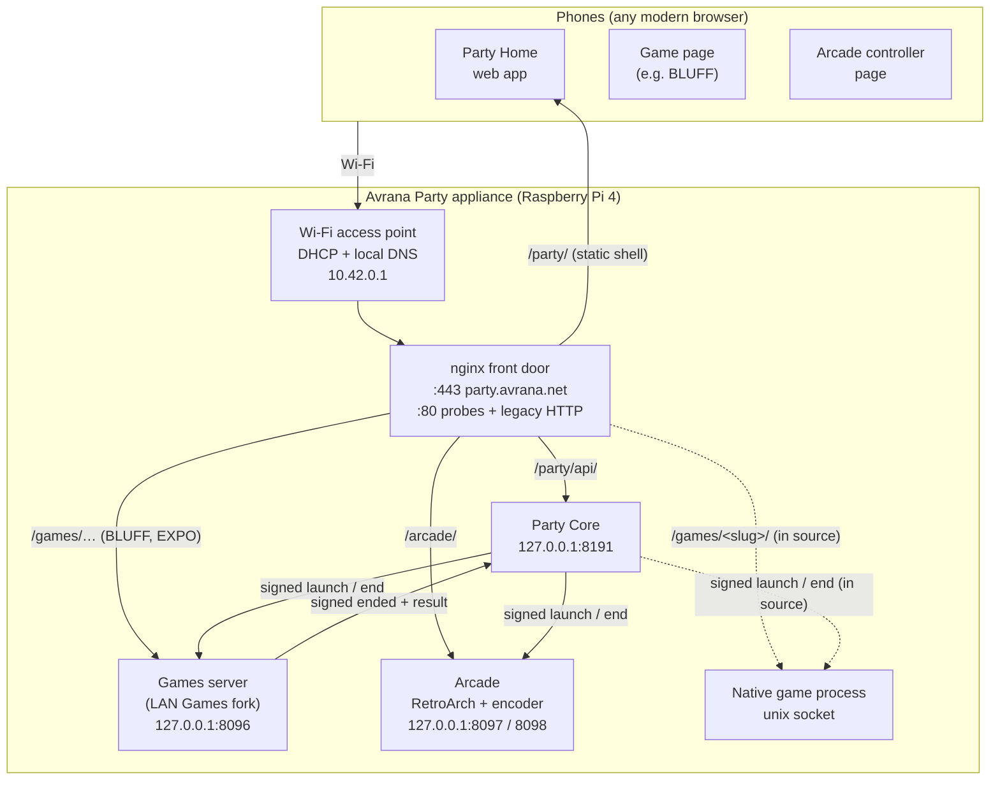

# Architecture overview

Avrana Party is a set of small services on one Raspberry Pi, with a single web front door, and
a web app on each phone. This page shows the whole system once. Each part is then described on
its own page.

## The system at a glance

The diagram is simplified. Solid lines are paths with deployment evidence. Dashed lines exist
only in source.

Some things the diagram makes visible:

- **There is one front door.** By design, phones only talk to nginx on the appliance. In
  source, every service behind it listens only on loopback (`127.0.0.1`) or on a Unix socket,
  so it cannot be reached from the network. The appliance has not caught up yet: on
  2026-10-03 its games server was still listening on all interfaces, because that fix had
  been merged but not deployed.
- **Party Core is not in the gameplay path.** Game traffic, including WebSockets, goes from the
  phone through nginx to the game server. Party Core handles who is in the Party and the
  lifecycle of a game session. It does not relay moves.
- **The Party talks to games through a signed protocol.** Launching, ending and reporting
  results are small signed messages exchanged over local connections. They are described on
  [Running a game session](game-sessions.md).

## The layers of responsibility

The project divides responsibility in a way that stays the same however a game is
implemented:

| Layer | Owns | Never owns |
|---|---|---|
| **Appliance** (network, front door, operations) | Wi-Fi, DNS, the HTTPS certificate, routing, service supervision, deployment | Party state or game rules |
| **Party** (Party Core and Party Home) | Device identity, membership and presence, the host role, the Party's single location, the catalog, navigation, the session lifecycle, and durable results and history in future | A game's rules, screens or private state |
| **Game** | Rules, rendering, game networking, private per-player views, deciding the outcome | A player's long-term identity, the Party's record of results, navigation outside its round |

A rule in the project's agent instructions puts it most directly: *Party owns cross-game
identity, presence, chat, library, navigation and durable results; Games owns rules and game
servers and never receives device identity.* The rest of this section explains how each
layer meets that rule.

## Where each topic is covered

-   [**The appliance and its network**](appliance-and-network.md)

    Hardware, the access point, local DNS, trusted HTTPS without internet, nginx routing, and
    Full versus Limited Mode.

-   [**The Party**](party.md)

    Device identity, membership and presence, the host and host succession, the Party's single
    location and the setup flow.

-   [**Running a game session**](game-sessions.md)

    Launch, tickets, admission, reconnect, end and results, with sequence diagrams.

-   [**Trust boundaries**](trust-boundaries.md)

    What is protected from whom today, what is not, and the accepted plan to tighten it.

-   [**Decision records in brief**](../decisions/index.md)

    All sixteen ADRs in plain language, with their real status.

## How the architecture got here

The architecture makes more sense with its history. In September 2026 the appliance ran
several independent systems:

1. A fork of **LAN Games**, an MIT-licensed self-hosted game hub with roughly thirty browser
   party games. Its upstream project was retired that month. The fork gave the project a working
   library and a chat for very little effort, and it is where BLUFF was built.
2. An **arcade** stream for *Gauntlet II*.
3. An experimental **PlayStation** stream.

Each of these had its own notion of a player. LAN Games identified a player by a token that the
browser generated for itself, which served at once as device, person, seat and reconnect
credential. The arcade had no identity at all: the first free controller slot went to whoever
connected.

The [party-platform decision](../decisions/index.md) replaced that with one Party layered over every game.
Party Core arrived as a small separate service. A signed session protocol bridged it to the
LAN Games fork, so that BLUFF could be played as a Party round. Later decisions made the host
authoritative over navigation, gave the Party a single location and made the arcade a
Party-launched provider.

At the start of October 2026 an architecture review concluded that the LAN Games fork had
become the de facto platform. It was one process holding every game's keys, and it relied on
a token any browser could forge. Three decisions followed. The LAN Games runtime is retiring.
Each native game becomes an isolated process with its own identity. Game pages move to a
browser origin separate from the Party's. Much of the groundwork for those decisions is now in
source; very little of it is deployed. That gap between source and appliance is the main thing
to keep in mind when reading the rest of this section.
