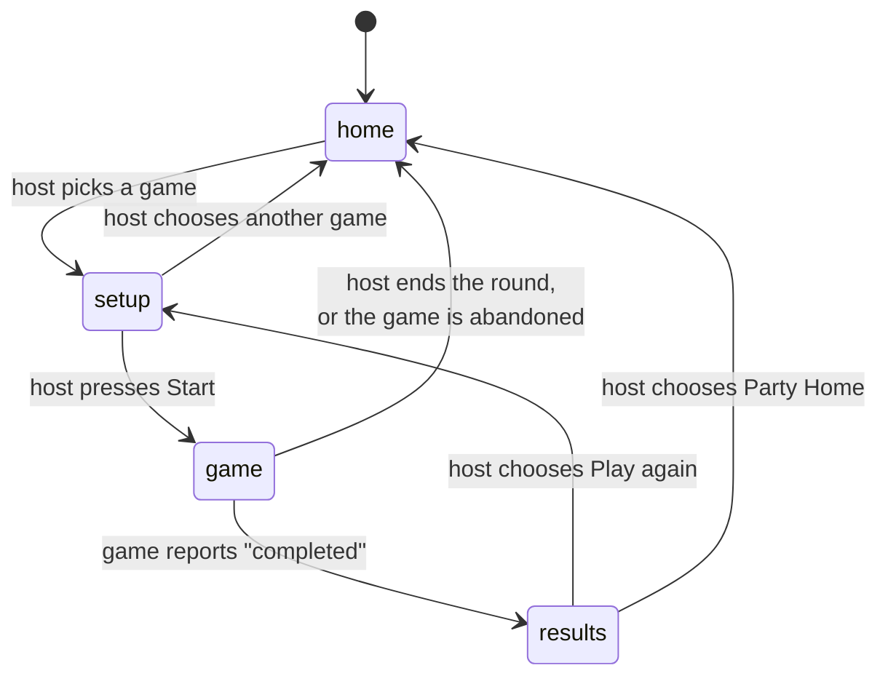

# The Party

The Party is the part of Avrana Party that does not change when the game does. It knows which
phones are here, who is hosting and where everyone should be. This page describes the concepts
first and then how Party Core, the small Python service at the centre, implements them.

## Identity is layered on purpose

The simplest design would be a single "player" record. The project rejected that early
([ADR 0002](../decisions/0002-party-platform.md),
[ADR 0003](../decisions/0003-ids-and-keys.md)),
after seeing what one token doing every job had done to the LAN Games fork. The platform keeps
these concepts separate:

| Concept | What it is | Today |
|---|---|---|
| **Device** | A recognized browser on a phone | Deployed A server-issued cookie |
| **Member** (a presence in the Party) | That device's membership in the current Party, with a display name and avatar | Deployed In Party Core's memory |
| **Participant** | A person's identity inside one game session: a random id issued for that session only | Deployed |
| **Seat** | A place in a particular game, such as an arcade controller slot | In source for the arcade |
| **Role** | Host, player or spectator. **Host is a role, not a credential.** | Deployed |
| **Profile** | A durable, optional person record that history could attach to | Planned Does not exist yet |

The [ADRs](../decisions/index.md) set a few invariants that hold throughout:

- **Identifiers grant nothing.** Knowing someone's member or participant id authorizes no
  action. Only a credential checked on the server does.
- **Identifiers are random and opaque.** They are never derived from names, MAC addresses, IP
  addresses or each other.
- **Display values never authorize.** A name, avatar or slot number is for showing to people.
- **Games never see device identity.** A game receives a participant id and a short-lived
  ticket for one session, and nothing durable.

### The device cookie

When a phone first joins, Party Core issues a random 256-bit token in a cookie. In current
source the cookie is `HttpOnly`, `Secure` and host-scoped (`__Host-avrana_device`), and lasts
about 400 days. The server stores only a SHA-256 hash of the token, mapped to a device id. A
client can never choose its own identity. An unknown, malformed or revoked token simply gets a
fresh one. A request that carries two copies of the cookie is treated as having no identity,
rather than guessing which copy is meant.

### Names and avatars live on the phone

The display name and avatar a player picks are stored in **the phone's browser**, not on the
server. The avatar comes from a bundled set of illustrated "Gaze" avatars. Party Core keeps
only the current display name and avatar id of each member, in memory.

This is a deliberate placeholder. The project is explicit that a browser-stored name is **not**
a durable identity, and that nothing persistent may be keyed by it. A server-side Profile, with
ideas such as guest-to-profile promotion, optional PINs and pairing a new phone, is direction
for later. It will have to exist before the Party stores any history about a person.

## Membership and presence

Owner-reported The console model
([ADR 0011](../decisions/0011-party-console-model.md))
made presence automatic. A phone with a name and avatar **is in the Party**: Party Home and
every game page join on their own when they load. There is no Join button and no Leave button
in normal use. The last verified deployment still had an explicit Join step. The console model
is in source, and the owner reports it as deployed since then. Neither a dated deployment
record nor a real-phone check exists yet.

Presence is computed, not declared. A member counts as **here** if Party Core has heard from
that phone in the last 45 seconds, and as **away** otherwise. While a round is on, a member can
also be **playing**. Membership itself ends only on an explicit leave, so a phone that sleeps
in a pocket drops to *away* and returns to *here* when it wakes, without losing anything.

## The host, and what happens when the host disappears

Every Party has at most one **host**: the person who picks games and moves the group. The host
is a role flag on a member, checked by the server on every host action.

- The first member to join becomes host. If the role is vacant, the first member seen takes
  it.
- The host can hand the role to someone else explicitly.
- If the host goes away for the presence window plus a 30-second grace period, and is not in
  the middle of a round, the role passes automatically to the **earliest-joined member who is
  still here**. When Limited Mode is in use, members in Full Mode are preferred.
- A former host who comes back does **not** take the role back. The project's phrase is "the
  host is disposable".

There is also a planned **System Admin** role for the appliance itself, protected by a PIN. It
is deliberately distinct from the host: hosting a party grants no system powers. The Admin role
exists only in the design documents so far.

## One Party, one location

Owner-reported The single most important idea in the current
Party design is that **the Party has exactly one location**, and every phone goes there.

The location is one of `home`, `setup`, `game` or `results`, plus which game and session it
refers to. Only the host's actions change it. A follower's own taps never move the Party. Each
change is versioned, so two conflicting host actions cannot both apply.

Every member page enforces the same rule on load, on reconnect and on every change: *home and
setup are shown in Party Home; a round and its results are shown on the game's page.* If a
phone is somewhere else, it is moved there, replacing the current page rather than offering a
button. That rule replaced an earlier design in which phones were offered "Rejoin" or "Join
them" prompts. A real-device test in late September 2026 showed that design leaving phones
stranded in the wrong place after a reload or a sleep. One authoritative location, applied
every time, removed that whole class of bug.

### Setup: Play or Watch

When the host picks a game, the Party enters `setup`. Every phone shows the Party's own
full-screen briefing for that game: its art and premise, who is hosting, a "How to play" sheet,
and two large choices, **Play this round** and **Watch this round**
([ADR 0010](../decisions/0010-party-pregame.md)).
The game supplies the briefing content as data, so the Party renders the setup consistently
for every game.

Only the host has **Start**. It stays disabled, with a one-line reason, until everyone who is
here has chosen and the player count fits the game. Phones that arrive after a round has
started join as spectators.

### Results are held

When a game reports that a round **completed**, the Party moves to `results` and stays there
until the host chooses **Play again** or **Party Home**. Nobody is bounced back to a lobby on a
timer, and the host's controls appear inside the game's own interface. If a game is
**abandoned** (it gave up, or a managed runtime failed), there is nothing worth showing, so the
Party goes straight home.

## Chat

Deployed · Retiring
Party Home has a shared Party Chat. Today it still runs on the chat service inherited from the
LAN Games fork, which identifies players by that fork's browser-generated token rather than by
the Party's device cookie. A Party-owned messaging design exists as a proposal, and the
platform's messaging architecture is open work. Chat has to be re-homed before the LAN Games
runtime can be switched off.

## What Party Core remembers

Party Core keeps the Party **in memory**. The only thing it writes to disk is the table of
hashed device tokens.

- If the service restarts or the appliance reboots, phones keep their device identity, but a
  new, empty Party starts. Phones rejoin it automatically.
- A Party ends after three hours with nobody present and no game running.
- There is no database. No results, history or profiles are stored.

Whether a Party should survive a reboot was left open in the identity ADR and is still open. For
a party-night appliance, "restart means a fresh party" is simple and predictable. It also means
an accidental power cut loses who was hosting.

## Where to read more

- [The Party platform design](../design/party-platform.md):
  the full platform design, including parts that are still proposals.
- [Party lifecycle](../design/party-lifecycle.md):
  the lifecycle rules in detail.
- [ADR 0011](../decisions/0011-party-console-model.md):
  the console model and its amendments.
