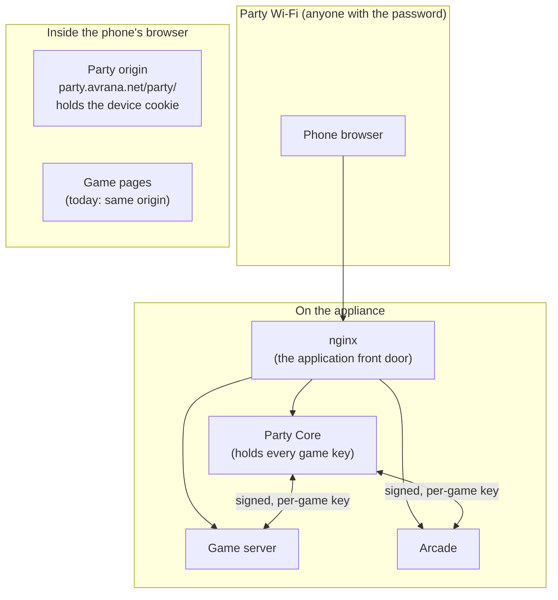

# Trust boundaries

What is protected from whom on an Avrana Party appliance today, what is designed but not yet in
place, and what is explicitly *not* promised. The engineering documents keep those three apart,
and so does this page.

The threat model is modest. An Avrana Party appliance is a box at a party. The people on its
Wi-Fi are mostly friends, but anyone with the Wi-Fi password can join. Games are written by the
project, or adapted by it from open-source code, so they may be buggy but are not assumed to be
hostile. Protecting against deliberately hostile third-party game code is a later and stronger
tier, and it is not designed yet.

## Three boundaries

### 1. Phones and the network versus the appliance

Deployed This is the strongest boundary today.

- nginx is meant to be the only *application* service reachable from the network. Party Core,
  the arcade and native games listen on loopback or Unix sockets. On 2026-10-03 the games
  server was a known exception: it still listened on all interfaces, because the fix had been
  merged but not deployed. The appliance also runs ordinary system services on the network:
  the access point's DHCP and DNS, mDNS, SSH, an `iperf3` server for Wi-Fi measurements and a
  telemetry agent.
- Party Core identifies phones only by a server-issued, `HttpOnly`, `Secure` cookie, and stores
  only its hash. Names, avatars and ids never authorize anything. Two deployed surfaces fall
  outside this model. Party Chat still runs on the LAN Games fork's chat service, which uses that
  fork's browser-generated token. And the deployed arcade gives a free controller to any phone
  on its page while *Gauntlet II* is the Party's game. Ticket admission for the arcade is in
  source.
- Game control endpoints (launch, end) accept requests only from the local machine and only
  when they are signed with that game's key. In source, nginx also refuses them outright from
  outside.
- Games filter private state per viewer on the server. BLUFF never sends another player's hand
  to your phone, and there are tests whose job is to catch that kind of leak.

**Not covered:** Device identity is cheap: a private browser tab is a new device. So the
platform cannot stop one person holding several memberships, and a host kick is not a ban.
Anyone who knows the Wi-Fi password is on the network. In
[Limited Mode](appliance-and-network.md#full-mode-and-limited-mode), traffic is plain HTTP that
another guest could read. That is why Limited Mode credentials are short-lived and grant no
elevated authority.

### 2. The Party versus game code in the browser

Accepted direction · mechanisms
In source · not deployed

Today every Party page and every game page is served from the same origin,
`https://party.avrana.net`. Same-origin JavaScript can call the Party API with the browser's
cookies attached. So a game page could, in principle, act as the player inside the Party. The
`HttpOnly` flag hides the cookie's value from scripts, but it does not stop the browser from
attaching the cookie to a script's request.

The project decided
([ADR 0013](../decisions/0013-party-and-game-browser-origins.md))
that **the browser origin is part of the trust boundary**. Game pages will move to their own
origin, and a game page will hold only what a Party-issued ticket gives one participant in one
session. The Party and the game talk through a narrow, explicitly designed bridge instead of
shared cookies. A small Party-owned frame exposes a fixed set of verbs through `postMessage`,
and a script the game loads from its own origin speaks to it.

The pieces are in source: the bridge frame, the shim game pages load, test vectors, per-game
origin checks on ticket requests and navigation to a game's registered origin. What is missing
is a second hostname, with DNS and certificate coverage, and the configuration that turns it on.
Until then, games remain same-origin.

### 3. Services versus each other on the appliance

Accepted direction · partly
In source · not deployed

This is the weakest boundary today, and the engineering documents say so directly. On the
appliance, as observed on 2026-10-03, **every Avrana service runs as the same Unix user**: the
owner's login account. As a result:

- Each game has its own signing key, but every service can read every key. A per-game key is
  only a boundary between processes that cannot read each other's files.
- "Accepted only from loopback" means "accepted from any process on this machine".
- Any service could read the others' state and rewrite the code they run.

The signatures themselves are sound: typed, bound to an audience and a session, expiring and
protected against replay. What is missing is a key that only two parties can read.
[ADR 0016](../decisions/0016-service-identities-and-local-trust-boundary.md)
defines the fix:

| Service | Planned identity |
|---|---|
| Party Core | A dedicated system user, `avrana-party`, the only holder of the master copy of every game key |
| Arcade | A dedicated system user, `avrana-arcade`, the only service with access to input and video devices |
| LAN Games fork (retiring) | A dedicated system user for as long as it exists |
| Each native game | A systemd **dynamic user**: a distinct, temporary uid per running game, which can read only its own key (passed in by systemd) and only its own state directory |
| The operator's account | Runs no service and owns no service secret |

Local connections are meant to be authorized by filesystem permissions on Unix sockets, not by
"it came from loopback".

In source today: the hardened Party Core unit running as its own user, a migration script, the
native-game unit template, and a read-only **boundary checker** that reports, rule by rule, how
far a host is from the target. When the checker was run against facts recorded from the
appliance on 2026-10-03, the appliance met 6 of the 25 first-phase rules. The migration itself
is an owner step and has not been recorded as done.

ADR 0016 is just as explicit about what it will **not** protect against: `root`, anyone with
`sudo` or physical access to the unencrypted storage, a compromised Party Core or nginx,
deliberately hostile game code, isolation between modules inside the legacy LAN Games process,
and anything a game can do with its own legitimate authority, such as misreporting its own
result.

## What this means for a reader

If you are evaluating Avrana Party, treat the appliance today as a **trusted-friends device**.
The network-facing surface is small and deliberately designed. Inside the box, the separation
between components is a plan with good groundwork in source, not yet a property of the deployed
system. [What works today, in detail](../status/index.md) tracks that work. The
[known discrepancies](../status/discrepancies.md) page records an open question about the device
cookie's scope while game pages still share the Party's origin.

## Where to read more

- [Browser origins](../design/browser-origins.md): the design for moving game pages to their own
  origin.
- [ADR 0013](../decisions/0013-party-and-game-browser-origins.md) and
  [ADR 0016](../decisions/0016-service-identities-and-local-trust-boundary.md): the decisions on
  browser origins and service identities.
