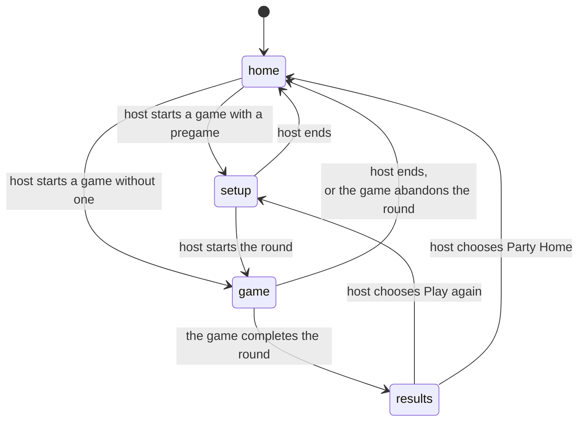

# ADR 0011: The console model (one party, one place, the host moves it)

!!! abstract "At a glance"
    **Decided:** 2026-09-29 · **Status:** In source · Owner-reported as deployed; not verified on real phones
    The Party works like one games console in the living room, not like several websites. It is
    always in exactly one place, only the host moves it, and every phone in the Party is always
    there.

## The problem

By late September 2026 the pieces each worked: [ADR 0007](0007-host-authoritative-launch.md) let
the host start games, [ADR 0008](0008-party-navigation.md) let game pages follow, and
[ADR 0010](0010-party-pregame.md) added a Play-or-Watch setup. A test with real devices on
2026-09-29 showed that together they still did not feel like one thing. In the ADR's words,
Avrana behaved like "several websites loosely following each other, not one shared console".
The testers ran into:

- **Joining twice.** A browser showed it was connected to the Party, and then still had to press
  **Join the party**.
- **Being in two places at once.** A phone could read "Your party is playing BLUFF" while opening
  and configuring Backgammon. Followers had **Back to Party** inside the game and wandered off.
- **Offers instead of moves.** Moves were offered ("Rejoin", "Join them") or depended on the page
  having watched them happen, so a reloaded or reopened phone could sit in the wrong place.
- **An unreadable setup.** BLUFF's setup was the Party's panel stacked above the live table, with
  an onboarding carousel on top: overlapping controls on a phone.
- **Party chatter during play**, such as "Setting up BLUFF" and "0 playing · 0 watching", above the
  game.

They share one root: the Party had no single answer to "where should this phone be right now?",
so every page made its own guess.

## What was decided

**1. One location.** Party Core keeps one authoritative **location** for the whole Party and
sends it in every state: **home** (Party Home), **setup** (a round being set up and started),
**game** (a round in progress) or **results** (a round the game finished, **held** until the host
moves on), plus the game and session it refers to.

Only the host moves it. Nothing a follower does on their own phone changes it.

**2. Presence is automatic.** A phone with an Avrana profile (a name and a Gaze avatar) is in the
Party. Party Home and every game page join on their own: on load, after Party Core restarts and on
a rename. There is no Join and no Leave button.

**3. Every member page is where the Party is, always.** One rule decides it: home and setup are
shown on Party Home; a round and its results on the game's page. Party Home, game pages and the
arcade apply it on load, on reconnect and on every change, *replacing* the current page if it is
in the wrong place. No offers, no banners, no "Rejoin", no memory of what the tab did. During a
round, Party Home cannot be browsed and no other game can be opened. A standalone title may stay
open while the Party is home, as a personal game, and is left the moment the host moves the
Party. A move that arrives while a phone is offline waits for the network.

**4. The setup is the Party's own full-screen scene** on Party Home, in its design system, not
above the game. It shows the game's art and title, who hosts, a one-line premise, one **How to
play** entry, the roster with each person's choice, two large choices (**Play this round**,
**Watch this round**), and either the host's **Start game** (disabled with one short reason) or
"Waiting for *host* to start". The host also has a quiet **Choose another game**. The game supplies
the content as data, in an `onboarding.json` file beside it. How to play is one sheet that opens
over the scene; a first-timer's Play opens it first, and "Got it, I'll play" counts as Play.

**5. The game owns the screen during a round.** In a Party, the games' integration bar, and Back
to Party with it, is hidden, and the page shows no Party text. Host controls live in the game's
own interface through a small browser API the Party provides. BLUFF puts End beside its rules
button, and on its results screen shows **Play again** and **Party Home** to the host and
"Waiting for *host*" to everyone else. A game without such controls gets one host-only End in its
bar.

**6. Rounds are the host's to end.** In a Party round BLUFF refuses its own "end game" and
empty-table takeover; a single player can still forfeit, since that moves nobody. Results are
held, with no 20-second timer back to a lobby of the game's own.

**7. Everything else stays:** Party Core as the authority for host, roles and roster; the
Play-or-Watch rules and spectator privacy; tickets, seats and reconnects; and standalone play
(no Party Core, no profile, or plain HTTP) exactly as before.

## Why this way

The test showed softer designs failing in ordinary situations: a reload, a sleeping phone, a
second tab. Every offer or remembered state was one more way to end up where the Party was not.
A single location owned by Party Core, obeyed by every page on every load, leaves nothing to
remember or guess; old tabs, stored memories and offers are simply ignored.

The screen layout follows the same logic. Party interface stacked on a live game was what made
the setup unreadable, so the two never share the screen: the Party owns it before a round, the
game during it.

## What it means in practice

For players, you open the page and you are in the Party, looking at whatever the host has put on.
A phone that sleeps through a change lands where the Party is when it wakes. For the host, each
decision sits in one place: the game picker at home, Start in setup, End inside the game, and
Play again or Party Home on the results. For game developers, the Party provides the setup scene
and moves people; the game supplies its premise and rules as data, owns the screen during play,
and hosts the host's controls.

## Later changes

- **2026-10-02, one Standard Mode activity.** Makes explicit what the decision implied: in
  Standard Mode, the normal product, there is one Party activity and one location at a time, by
  design. Simultaneous games are not a Standard Mode feature; any future Developer Mode for that
  must add nothing to Standard Mode. The "personal standalone game" and "standalone play" above
  describe LAN Games compatibility, which [ADR 0014](0014-native-games-isolated-lan-games-retired.md)
  retires; they stay true of the code until then. How host controls reach the game is revisited
  by [ADR 0013](0013-party-and-game-browser-origins.md).
- **2026-10-02, lifecycle edge cases (AVR-223).** Results are held only for a round the game
  reports **completed**. An abandoned round sends the Party straight home and is ended at the game.
  A host switch goes straight to the next game's setup instead of through Party Home. An end the
  game does not confirm in time is recorded with a reason, and a launch that succeeds after the
  Party gave up is ended at the game.
- **2026-10-05, the owner's UX redesign.** The setup scene gains a Party control with a drawer
  of who is here and, on a phone in Limited Mode, that mode's explanation
  ([ADR 0012](0012-limited-mode-party-survives-https-loss.md)). Both open over the scene and leave
  the phone on it; Party chat is not shown there. In source
  since 2026-10-06, not deployed or checked on a phone.

## Where it stands today

In source in both repositories: the location in Party Core,
the routing rule shared by Party Home, game pages and the arcade, automatic presence, the
host-only return to Party Home, avatars, the setup scene, and BLUFF's held results and host
controls.

Owner-reported as deployed. The ADR's own status line
(reconciled 2026-10-01) still says deployment is pending, and the last verified deployment
(2026-09-29) predates this decision: it still had the explicit Join and the "Rejoin" offers. No
dated record of a later deployment exists ([Known discrepancies](../status/discrepancies.md)).

**Not verified on real phones.** Automated browser tests run at phone size (390 by 844 pixels),
but nobody has confirmed on real devices that a phone asleep through a move lands correctly, or
how iPhone and Android back buttons behave after a page is replaced.

## Related decisions

- [ADR 0007](0007-host-authoritative-launch.md): its reconnect rule and manual Join are replaced.
- [ADR 0008](0008-party-navigation.md): its "follow only what you watched" rule and in-game Party
  line are replaced; its navigation record feeds the location.
- [ADR 0010](0010-party-pregame.md): its setup moves to Party Home.
- [ADR 0012](0012-limited-mode-party-survives-https-loss.md),
  [ADR 0013](0013-party-and-game-browser-origins.md) and
  [ADR 0014](0014-native-games-isolated-lan-games-retired.md), cited by the amendments.
- [The Party](../architecture/party.md#one-party-one-location), for the location today.
