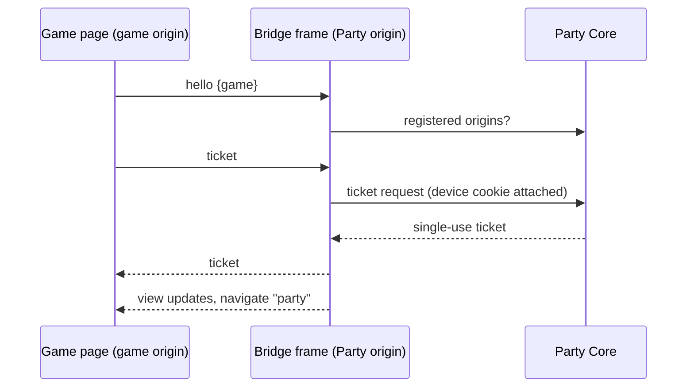

# ADR 0013: The Party shell and game pages have separate browser origins

!!! abstract "At a glance"
    **Decided:** 2026-10-02, mechanisms 2026-10-03 · **Status:** Accepted direction; mechanisms In source; not configured or deployed
    Game pages should run on a different browser origin from the Party, so that game JavaScript
    cannot act as the player inside the Party. The two talk only through a small Party-owned
    bridge with a fixed set of verbs.

## The problem

A browser **origin** is a page's scheme, host name and port. Browsers isolate cookies, storage and
scripts by origin. Earlier decisions put the Party, games and arcade on one origin,
`https://party.avrana.net`, separated only by path.

Path-scoped `HttpOnly` cookies hide the device token from scripts, but any script on the origin
can still call `/party/api/…` and the browser attaches the cookie. That limit was known and
deferred until third-party games arrived. The 2026-10-02 review judged the deferral wrong: game
code is already effectively third-party. The Games repository has its own release cadence, BLUFF
ships with around 30 donor titles, and future games are independent consumers. If a game page can
act as the viewer against host APIs, every game bug becomes a Party bug.

## What was decided

- **The origin is part of the trust boundary.** The **Party origin** serves Party Home, setup,
  profile and system pages and the Party API, and holds device identity, membership and host
  controls. **Game origins** serve game pages, assets and WebSockets, and hold only a Party-issued
  ticket for one participant in one session ([ADR 0006](0006-party-session-protocol.md)) and the
  game's own token.
- **Playing a game grants it no Party authority.** A game page cannot present the member's
  cookie, call host actions, read Party state beyond what the Party publishes to games, or reach
  a future admin interface.
- **Designed seams, not shared cookies.** In-round host controls (End, Play again, Party Home)
  and presence from game pages move to an explicit mechanism.
- **A second host name first**, under the existing certificate and local DNS, so cookies,
  storage and service workers separate by construction.
- **Community sandboxing comes later.** This split applies to *all* games, trusted ones included.
- **No cross-origin identity recovery** in either direction.

## Why this way

A **separate host name** separates everything by construction. A **separate port** does not,
because browsers share cookies across ports. A **CSP sandbox** gives a `null` origin and
second-class browser features. The host-name option also avoids the iframe drawbacks
(fullscreen, audio unlock, storage) that [ADR 0002](0002-party-platform.md) held against frames.

## What it means in practice

ADR 0002's Party *service* placement stands, but games no longer share its browser origin.
[ADR 0004](0004-full-mode-contracts-and-providers.md)'s canonical Party address stands, but games
move off it. ADR 0006's note that a game page can call the Party API with the cookie stays true of
the deployed system, and is what this ADR removes. [ADR 0011](0011-party-console-model.md)'s host
controls stay in the game's chrome; only their transport changes. Three consumers needed
replacements before cutover: the arcade phone page, the Games integration scripts and BLUFF's
host chrome. Turning the new origin on changes DNS, certificate names and nginx, an
owner-approved live change.

## Later changes

On 2026-10-03 the owner accepted five mechanisms from the
[browser origins design](../design/browser-origins.md):

| | Decision |
|---|---|
| D1 | One shared game origin now. The bridge is keyed by origin, so one origin per game later is configuration. |
| D2 | A **Party-owned, invisible bridge frame** is the only seam, with a closed verb set: `ticket`, `view`, `navigate`, `end`, `home`, `playAgain`. |
| D3 | The device cookie becomes `__Host-avrana_device` with `Path=/`; for one release the old cookie is still read and swapped for the new one. |
| D4 | The game host name is `games.avrana.net`. |
| D5 | This work comes before Checkers. |

The game page loads a small **shim** script that embeds the Party's bridge frame and exchanges
`postMessage` messages with it. The frame answers only a parent whose origin Party Core has
registered for that game, replies only to that origin, ignores malformed messages, and never
sends a URL.

The `__Host-` prefix makes browsers refuse that cookie from another host or over plain HTTP, so a
sibling origin cannot plant one.

## Where it stands today

In source, not configured, not deployed. The Party
repository has the bridge frame, the reference shim, test vectors, Party Core's `game_origins`
setting, the origin-checked ticket route, the `__Host-` cookie with its fallback, and refusal of
Party API requests the browser marks as cross-site. The Games repository carries the shim, and
the ADR records game pages and the arcade page as moved onto it.

Missing are the owner-only live changes (certificate name, DNS record, nginx server block, the
`frame-ancestors` header) and real-phone validation. Until then every page is still served from
`https://party.avrana.net` and the bridge is not relied on for field testing. The site's
[known discrepancies](../status/discrepancies.md#1-the-device-cookie-and-same-origin-game-servers)
page raises an open question about the new cookie's `Path=/` while games still share the host.
Limited Mode settled its own case: games use the Party's origin there
([ADR 0012](0012-limited-mode-party-survives-https-loss.md) D5). The community sandbox tier
remains open.

## Related decisions

- [ADR 0002: the party platform](0002-party-platform.md) and [ADR 0004: Full Mode](0004-full-mode-contracts-and-providers.md), whose one-origin assumption this amends
- [ADR 0003: identifiers and keys](0003-ids-and-keys.md) and [ADR 0006: the session protocol](0006-party-session-protocol.md)
- [ADR 0011: the console model](0011-party-console-model.md)
- [ADR 0012: Limited Mode](0012-limited-mode-party-survives-https-loss.md) and [ADR 0014: native games](0014-native-games-isolated-lan-games-retired.md)
- [Browser origins design](../design/browser-origins.md) and [trust boundaries](../architecture/trust-boundaries.md)
