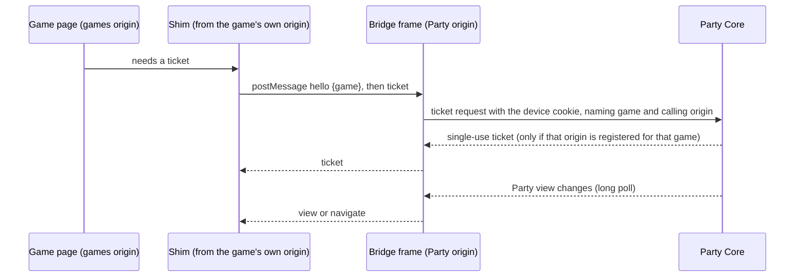

# Browser origins

!!! abstract "What this document governs"
    BROWSER-ORIGINS describes the mechanisms behind
    [ADR 0013](../decisions/0013-party-and-game-browser-origins.md): moving game pages to a
    browser origin of their own, so that game code can never act as a Party member. The owner
    accepted the mechanisms, decisions D1 to D5, on 2026-10-03. Steps 1 to 3 of its five-step
    rollout (the Party side, the Games side and the arcade page) are
    In source. Step 4, the live configuration, has not
    happened, so **nothing is configured or deployed** and every game still runs on the Party's
    origin. Step 5, the real-phone test, has not been run.

## The problem

Today one origin, `https://party.avrana.net`, serves Party Home, every game page and the arcade
page. Game pages also run Party code inside themselves: they load the Party's navigation
follower, which long-polls the Party API with the member's cookie, exposes the host's End, Party
Home and Play again actions, and fetches tickets.

That is convenient but it means **any game page can act as the member it is shown to**. Marking
the cookie `HttpOnly` stops scripts reading its value, but the browser still attaches it to a
script's request to the same origin. ADR 0013 decided that the browser origin is part of the
trust boundary: the Party shell and game clients must be separate trust domains, and a game page
should hold only the session-scoped authority a ticket gives. See
[Trust boundaries](../architecture/trust-boundaries.md#2-the-party-versus-game-code-in-the-browser).

## Three browser facts that shape the design

**A sibling host name is still the same *site*.** `games.avrana.net` and `party.avrana.net` share
the registrable domain `avrana.net`. The cookie setting `SameSite=Lax` only restricts *cross-site*
requests, so a script on the game origin that calls the Party API with credentials does make the
browser attach the device cookie. What stops it is not the cookie but two Party Core controls:
the `Origin` allow-list on state-changing requests, and the absence of permissive CORS headers,
so a game cannot read a response. These controls become load-bearing.

**A sibling host can plant cookies.** A page on `games.avrana.net` could set a cookie named like
the Party's for the whole `avrana.net` domain, and the browser would then send *two* device
cookies to the Party. The defences are cheap: refuse any request that carries the name twice
(done), and rename the cookie with the `__Host-` prefix, which browsers refuse to accept with a
domain attribute or from a non-secure origin.

**Storage is per origin.** The game origin starts empty: no stored name, avatar or Party profile.
That is intended. Names already reach a game through the launch roster.

## Host names

**Decision D1 and D4**: one shared game host name, `games.avrana.net`, as a sibling of the Party
host, both served by the appliance and both on one certificate.

| Origin | Serves | Holds |
|---|---|---|
| `https://party.avrana.net` | Party Home, setup, the Party API, the bridge page | the device cookie |
| `https://games.avrana.net` | every game page, game assets and WebSockets, the arcade page | nothing durable; tickets in memory |

One shared game origin isolates games from the Party, but not from each other. A host name per
game would do both, at the cost of a wildcard certificate and wildcard DNS. The decision is to
start with one shared origin for first-party games, and build the bridge so it keys on the
calling origin; per-game host names then become a configuration change when community games
arrive. A name nested under `party.` was rejected as gaining nothing.

## The bridge

**Decision D2** chose how a game page on its own origin still gets tickets, keeps the player
present, and lets the host end a round. The answer is a **Party-owned bridge frame**.

- The game page embeds one invisible frame, `bridge.html`, from the Party origin. Because the
  frame is on the same site, the browser sends it the device cookie.
- The frame runs what the in-page follower runs today: the long poll, presence and the "where is
  the Party" decision. Presence therefore continues while a game is open, maintained by the
  Party's own code rather than the game's.
- The frame talks to its parent only by `postMessage`, and only to a parent whose origin is
  registered for the game the Party is currently running. Any other parent gets silence.
- The game loads a small **shim** from its own origin that wraps the messages as the same
  `window.AvranaParty` interface games already use.

The verb set is closed: `ticket` (for this game and session only), `view` (pushed: host name,
whether I am host, location and round state, with no ids of any kind), `navigate` (pushed: go to
the Party; it carries the word `party`, never a URL), and the host-only `end`, `home` and
`playAgain`, which Party Core checks exactly as now.

What could a hostile game do with this? End its own round and ask for tickets to itself, both of
which it could already do from its server. It cannot launch another game, transfer the host,
rename anyone, read more of the roster than its launch already carried, or reach any future admin
surface.

In source The contract is `avrana.party-bridge/v1`, with
test vectors. Party Core refuses a ticket request whose calling origin is not registered for that
game. One control was added beyond the proposal: Party Core refuses every API request the browser
marks as coming from a same-site or cross-site page, so a game page's own direct requests are
refused even for reads, which the `Origin` allow-list does not cover.

Three alternatives were considered and rejected:

- **A visible Party-owned overlay for host controls.** It keeps host verbs out of game code, but
  breaks the console model's rule that host controls live in the game's own chrome, and still
  needs another route for tickets.
- **Endpoints authorized by ticket.** It would turn the single-use, 120-second ticket into a
  long-lived session credential in all but name.
- **The ticket in the URL fragment at launch.** It breaks "tickets never appear in a URL" and
  does nothing for reconnects.

## The cookie

**Decision D3**: rename the device cookie to `__Host-avrana_device` with `Path=/`, `Secure`,
`HttpOnly` and `SameSite=Lax`. Party Core issues the new name and still reads the old one for one
release, so phones already in the room keep their membership.
In source.

The `__Host-` prefix requires `Path=/`, which the design calls safe once game servers no longer
share the Party's host. In current source the rename has landed while games still share the host,
which is recorded as an open question on
[Known discrepancies](../status/discrepancies.md#1-the-device-cookie-and-same-origin-game-servers).

## Returning to the Party

A return is always a top-level navigation to a fixed Party address that the game never supplies.
In Limited Mode, over plain HTTP on an IP address, there is no second host name; first-party
games stay on the same origin there and an untrusted tier is unavailable (see
[Limited Mode](limited-mode.md)).

## How a page knows where the Party is

Steps 2 and 3 changed the Games server and the arcade so that **each page asks its own server**
where the Party is, and nothing else can tell it. The games server and the arcade each report a
Party origin from one environment setting, which is documented and unset.

- If the answer is unset, or the same as the page's own origin, the page keeps today's
  same-origin path.
- If it names another origin, the page uses the bridge and never calls the Party API itself.
- The origin is never read from the address bar, a link or a message. A server that gives no
  answer (a timeout or an error) has not said "same origin", so the page asks again.

So the code is in place on both sides, and **nothing changes on the appliance until step 4**.

## Rollout

| Step | What | State |
|---|---|---|
| 1 | Party: bridge frame, message contract and vectors, origin-keyed ticket route, renamed cookie with dual read | In source, browser-tested with two host names of one site |
| 2 | Games: vendor the shim, switch ticket fetching and BLUFF's host chrome to it, keep same-origin as a fallback | In source |
| 3 | Arcade page: the same shim | In source |
| 4 | Certificate name, local DNS record, nginx server block, Party Core's game-origin registry, and the Party origin setting for games and arcade, all together | Not done; owner-approved live change |
| 5 | Real phones | Not done |

The automated proof runs in Chromium with two host names of one site, including the real BLUFF
page and games server against the real Party Core: seating by ticket, keeping the seat through a
reload, only the host ending, a stranger getting no seat, and the page holding no cookie and
sending the Party API nothing. It does not cover Safari, HTTPS, the `__Host-` cookie or nginx.

Step 4 has to be applied as a whole or not at all. The committed nginx site has no
`games.avrana.net` server, and the strict content-security policy on `/party/` still forbids
framing entirely.

## The real-phone test

The document is explicit that **the bridge is not relied on for field testing until it has passed
on real phones**, which needs step 4 first and belongs to the owner. On an iPhone with Safari and
an Android phone with Chrome, during a round, it checks that the frame loads without a framing
refusal; that the cookie reaches the frame (host controls appear only for the host, and a guest
shows as present on another phone); that tickets work, including a fresh one after a reload; that
the game origin holds no cookie or Party storage; that presence stays "here" for several minutes
with a game open; that the host's End and a switch move every phone correctly; that sleep and
wake land the phone where the Party is; that private browsing and Safari's cross-site tracking
prevention do not break it; that a phone from before the cookie rename keeps its membership; and
that a direct call to the Party API from the game page's console is refused. Results go in a dated
finding.

## Not proposed

A sandboxed content-security tier (later, for community games), putting the games themselves in
frames, any change to tickets, keys or the session protocol, and a per-game service-worker policy.
