# Party lifecycle

!!! abstract "What this document governs"
    PARTY-LIFECYCLE describes how the Party behaves over time: the shared location, a member's
    presence, the host role, and seats inside a game, plus the rules for awkward moments such as
    a host vanishing mid-launch. It is the **canonical lifecycle narrative**. Membership,
    liveness, host grace and succession, one session at a time, synchronized navigation and
    Play-or-Watch setup are Deployed. The console model's
    automatic presence is In source and
    Owner-reported as deployed. The seat rules are
    requirements for game integrations, not a built platform seat layer. The timer values on
    this page were checked against Party Core's code.

## Two meanings of "profile"

The lifecycle document warns about a word that means two things. When it says a phone joins
"with an Avrana profile", it means the name and avatar stored in that phone's browser. That is
a display value which triggers automatic presence; it is not identity and it is not durable.
When it says "saved profile", it means the future, optional, server-side Profile, which does not
exist yet. The device cookie and live Party identity (presence and seats) are a third thing,
separate from both. See [The Party](../architecture/party.md#identity-is-layered-on-purpose).

## Decisions this document implements

- **One appliance, one party.** There is no party selector and no multi-party mode. A single
  active activity is the product model, not a temporary limit.
- **The host is disposable.** The party never depends on one phone. Losing the host leads to a
  grace period and then succession; a returning former host does not take the role back.
- **Late joiners watch by default.** A game may opt into more through its contract's `late_join`
  field, though Party Core v0 admits late arrivals only as spectators.
- **Physical seating is not modelled.** "Seating" means who holds which game slot, never where
  people sit.

## Global rules

Six rules, numbered R1 to R6 in the original, keep the Party consistent. All but the last are
built into Party Core.

1. **One change at a time, with a version.** Party Core applies changes one after another and
   bumps a version number each time. Every host action carries the version the phone last saw,
   and host rights are re-checked when the action is applied. A stale request, or one from a
   phone that is no longer host, is refused with "The party changed. Have another look and try
   again."
2. **Navigation moves only on committed transitions.** The Party's location moves when a game
   has actually started or ended, never on intent, so nothing ever has to be undone.
3. **A disconnected or away seat is never free.** Only a released seat can be refilled, and a
   refill gets a new identity and key.
4. **Deadlines hold when someone acts.** Every due timer is applied before each operation, not
   only by a background tick. A request from a host whose grace has run out is refused even if
   the tick has not run yet.
5. **Navigation is keyed by party and sequence number.** The counter restarts in a new party, so
   a phone never compares the counter alone.
6. **A saved profile has at most one live presence.** This is a proposal that waits on profiles.

## The Party's location

There is one shared location: `home`, `setup`, `game` or `results`. Only the host moves it, and
every member's phone renders it.

```mermaid
stateDiagram-v2
  [*] --> home: a phone with a name joins
  home --> setup: host picks a game with a briefing
  setup --> game: everyone here chose; host Start; game confirms
  setup --> home: host cancels, or the launch fails
  home --> game: host launches a game without a briefing
  game --> results: the game reports the round completed
  game --> home: host ends the round, or the game is abandoned
  results --> setup: host Play again
  results --> home: host Party Home
```

This location is the product view. Underneath, a game session runs through its own protocol
states (setup, launching, active, ending, ended; see
[Running a game session](../architecture/game-sessions.md)). While a launch is pending, the
location stays at setup; a failed launch sends everyone home. Switching games ends the current
session before the next one exists, and if the old game does not confirm that it stopped, the
switch stops there rather than start a game on top of one that may still be running. In source,
a successful switch moves phones straight to the next game's setup without passing through
Party Home.

Completed results are held until the host moves on. There is no automatic timer back to a
lobby. An abandoned round has no results to show, so the Party goes home.

## Presence

A member is in one of three states, computed rather than declared:

- **here** if Party Core has heard from that phone in the last **45 seconds** (the live window);
- **away** otherwise;
- **playing** while they hold a place in the game session that is currently active.

"Heard from" means any authenticated Party request: Party Home's long poll, a game page's
heartbeat, or a ticket fetch. A phone that sleeps, locks its screen, closes a tab or walks into a
game does not leave. It drifts to *away* and comes back to *here* when it next makes a request.
When a round ends, members coming back from the game count as seen at that moment, so the whole
table does not briefly look away.

Normal use has **no Leave button**. A lower-level leave operation exists for cleanup and tests;
if the leaving member was host, the next present member takes over at once. Kicks are not built.
Inside a game, disconnects, autopilot and pauses are the game's business; the Party does not
duplicate those timers.

## The host

Deployed for grace and succession; explicit hand-over
is in Party Core but the broader transfer policy is still design.

```mermaid
stateDiagram-v2
  [*] --> held: first member joins
  held --> held: host hands over to someone here
  held --> grace: host stops being heard from
  grace --> held: host returns in time
  grace --> held: grace ends; a successor is chosen
  grace --> vacant: grace ends; nobody is here
  vacant --> held: the next member who is seen takes it
```

What Party Core actually does:

- The **first member to join** becomes host. If the role is vacant, the next member Party Core
  hears from takes it, which may be the former host.
- A host can hand the role to another member **who is here**.
- A host who is **playing** in the active round never loses the role by succession.
- Otherwise, once the host has not been heard from for the 45-second live window **plus a
  30-second grace** (75 seconds in all), the role passes to the **earliest-joined member who is
  here or playing**. In source, a Full Mode member is preferred over a Limited Mode one, and a
  Limited Mode host who is still here is never displaced (see [Limited Mode](limited-mode.md)).
- If nobody is present, the role is vacant until someone is.

A future TV or public screen would never become host.

## Seats

Seats belong to a game session. The document's seat state machine is a **target contract** for
games and runtimes, not a built platform layer. BLUFF keeps its own reconnect identity; the
arcade's session-local controller reservations with a 60-second hold are
In source, without deployment or real-phone proof.

The essential rules: a seat that loses its phone goes **disconnected** and its input goes
neutral at once; after a grace it becomes **away** but stays reserved while the game
autopilots, idles or pauses; the owner can reclaim it at any point. Only an explicit release
(the owner leaves, the host removes them, or an automatic release in games that declare open
seats) frees the slot, and whoever fills it next gets a new seat identity and key.

## Awkward situations

The original keeps a table of edge cases. Some are built behaviour, others are design
requirements. The ones a newcomer most often asks about:

- **Two taps, or the host changes mid-request.** The version check refuses the stale one.
- **The host leaves while a game is launching.** The launch belongs to the Party and continues;
  whoever is host now may cancel it.
- **Someone arrives during setup.** If they are here, they must choose Play or Watch before the
  host can start. After the start the roster is frozen and later arrivals watch.
- **A phone sleeps during setup.** Away members do not block the Start; only the choices of
  members who are here form the roster.
- **Every phone sleeps.** The host role goes vacant after grace and the Party waits.
- **The same phone has two tabs.** It is one membership. The target rule for seats is that the
  newest controlling connection wins and older ones say "opened elsewhere".
- **The only player disconnects mid-game.** The design says the seat goes neutral, then away,
  the game pauses, and after a table-abandon period the session ends as abandoned and the Party
  goes home.
- **A game or service crashes.** The protocol's outcomes are completed, abandoned, ended by the
  host and launch failed. A Party Core restart resets the in-memory Party. Retrying is the host's
  call.
- **A seat owner returns after the host gave the seat away.** They watch, with priority at the
  next deal; their old key no longer works.

## Timers

These values were verified in Party Core's code:

| Timer | Value | What it does |
|---|---|---|
| Live window | 45 s | Silence after which a member counts as away |
| Host grace | 30 s | Extra time past the live window before succession |
| Launch timeout | 60 s | Time for a game to accept a launch, otherwise "launch failed" |
| End timeout | 15 s | Time for a game to confirm an end before the Party stops waiting |
| Party idle | 3 h | Time with nobody present and no session before the Party ends |

The document also proposes defaults that are **not** Party Core values: a seat and presence
grace of 60 seconds (a game may choose longer), a five-minute table-abandon period, and
automatic release of away seats after five minutes only for games that declare open seats. Real
values for seats are left to real-phone evidence.

When a Party ends after the idle period, the next visitor starts a fresh one.

## Still open

**Does a party survive an appliance reboot?** Today it does not: Party Core keeps the Party in
memory, so a restart starts an empty Party, though phones keep their device identity and rejoin
on their own. The document lays out three options and leaves the choice to the owner:

- **Ephemeral**: a reboot starts a new party. Simplest, but guests lose names and seating.
- **Resume if fresh**: snapshot the party (never a live game) on every change and resume it on
  boot if the snapshot is under about 30 minutes old.
- **Ask**: the first phone after boot chooses between resuming and starting fresh.

The document leans towards "resume if fresh", with "ask" as a fallback, because a known failure
mode is resets from under-voltage.

Other open points:

- **The scope of the version check.** Because the version is party-wide, a guest joining can
  make the host's in-flight request stale. That is safe but occasionally annoying; a narrower
  version is the alternative.
- **Kicks** (proposed, not decided): a kick would remove the presence and bar that device token
  from this party. It is not a ban, since a private tab is a new device.
- Spectator voting and nominating, and host-less kiosk parties.
