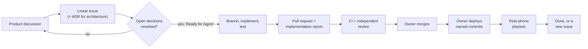

# Contributing

Avrana Party is developed by its owner together with AI coding agents. The process is written
down in detail, and it applies to human contributors as well. This page explains the shape of
that process. The binding rules are in
[CONTRIBUTING](https://github.com/rcnechamkin/avrana-party/blob/main/CONTRIBUTING.md),
[AGENTS](https://github.com/rcnechamkin/avrana-party/blob/main/AGENTS.md) and
[WORKFLOW](https://github.com/rcnechamkin/avrana-party/blob/main/docs/WORKFLOW.md).

## How to get involved

The project is early and owner-led, and its guidance for outside contributors is still thin.
This is what the engineering repositories establish:

- **Bug reports** are invited in the Party README. Include the device and browser, steps to
  reproduce, expected and actual behaviour, and whether you used the local development server or
  a physical appliance. Never include credentials, secrets or personal data. The repositories are
  on GitHub, so the natural place for a report or question is the relevant repository's issue
  tracker.
- **Live work lives in Linear**, in the workspace linked from the README. The documentation does
  not say how outsiders get access. The contribution guide says that if you cannot access it,
  you should ask the maintainer to confirm scope before starting anything substantial.
- **Licensing is unresolved for the Party repository.** It has no license file, and its package
  metadata disagrees with that. The contribution guide explicitly grants no license. Until the
  owner decides, the terms on which outside contributions would be accepted are undefined. The
  Games repository is MIT-licensed.
- **No contact channel, code of conduct or external contribution policy** is documented yet.

If you are considering a substantial contribution, open an issue first and describe what you
want to do.

## The loop

Some steps are deliberately human: product discussion, deciding that an issue is ready,
merging, deploying and testing on real phones. Agents and contributors do everything between
"ready" and "pull request". They also build the deployment and test machinery, but they never
run it against the appliance.

## Before you start

Work starts from a Linear issue. [Linear](https://linear.app/avranakern) holds live
priorities, sequencing and acceptance criteria. An implementation issue has a fixed structure:
*Outcome*, *Acceptance Criteria*, *Out of Scope*, *Repositories*, *Tests Required*,
*Dependencies* and *Open Decisions*. An issue is not ready while *Open Decisions* still holds an
unresolved product question. The expected behaviour then is to stop and ask, not to guess. The
roadmap is not a task list: it describes direction. Archived prompts and old handoffs are
history, not instructions.

Before writing anything, check the open pull requests in both repositories to avoid overlapping
work. Then read the current code the issue touches, and only after that the ADRs and design
documents the code cites.

## Making the change

- Branch from the current `main` as `type/avr-N-short-description`, where the type is one of
  `feat`, `fix`, `chore`, `docs` or `experiment`.
- If the Party ↔ Games boundary moves, change both repositories on **paired branches** with
  the same `avr-N`. CI tests each side against the other's matching branch.
- Name the tests that will prove the change before writing it, and add or extend them alongside
  the code.
- For changes the owner must merge (see below), post a short plan on the issue first, covering
  files, order, risks and proof, and wait for it to be accepted.
- Keep unrelated changes out. Never force-push or rewrite history.
- Update canonical documentation when behaviour or architecture changes. Every Markdown file in
  the repository needs an entry in the documentation manifest, and `npm run check:repo`
  enforces that.

## Submitting

A pull request ends with the project's
[implementation report](https://github.com/rcnechamkin/avrana-party/blob/main/docs/agents/IMPLEMENTATION-REPORT.md).
It lists the issue, branches and commits, behavioural changes, exact test commands and their
results, documentation changed, whether anything was deployed (normally "no"), blockers and
follow-ups. Untested hardware behaviour is stated as untested.

Every change is reviewed by someone other than its author, against a written checklist
([REVIEW](https://github.com/rcnechamkin/avrana-party/blob/main/REVIEW.md)) with three passes:

- **Bugs**: logic errors, regressions, tests that cannot fail.
- **Trust**: anything that moves a security boundary, such as cookies, origins, key files,
  listeners, or what a game can make the Party do.
- **Fit**: whether the change does what the issue asks and nothing more, agrees with accepted
  ADRs, and leaves the system map describing only deployed reality.

The review ends by naming a **change class**. Architecture, security, protocol and contract
changes, anything under `deploy/` or `ops/`, the nginx site and product decisions are merged
only by the owner. Routine changes can follow a lighter path.

## What is never acceptable

These come straight from the project's safety rules:

- deploying, restarting or editing anything on the appliance without explicit written
  authorization;
- changing a public contract silently. Session protocol, routes, launch integration, catalog
  snapshot, capability vocabulary and the HTTPS rules change only through declarations, tests
  and paired pull requests;
- skipping a required test because it is inconvenient. Report it as not run instead;
- committing credentials, keys, Wi-Fi secrets, ROMs, BIOS files, emulator cores, save files,
  runtime data, personal telemetry or raw logs;
- hand-editing generated files;
- editing a dated finding or an archived document as if it were current. Write a new dated
  finding, or update the canonical document;
- describing something as deployed or validated when it is not.

## Security reports

Do not put credentials or exploit details that could expose a live appliance in a public issue.
Use GitHub's private vulnerability reporting if the repository offers it. Otherwise, ask the
maintainer for a private channel without including the sensitive details.
