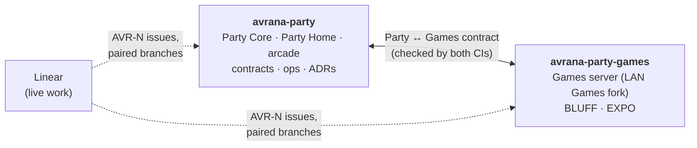

# Repository ecosystem

## The two engineering repositories

### `avrana-party`

[github.com/rcnechamkin/avrana-party](https://github.com/rcnechamkin/avrana-party). This is the
platform, and it holds most of the project:

| Directory | Contents |
|---|---|
| `avrana/party/` | **Party Core**: the service, the session protocol reference implementation, identity, the result envelope, the game registry |
| `avrana/contracts/` | Game-contract validation, capability evaluation and the catalog compiler |
| `avrana/providers/` | Runtime, input and presentation providers (RetroArch, virtual gamepad, PlayStation profiles) |
| `avrana/ops/` | Deployment manifest, status endpoint, smoke checks, boundary checker, provisioning, rebuild |
| `avrana/web/` | The local development server |
| `web/party/`, `web/src/` | **Party Home**, the phone web app (Tailwind CSS and daisyUI) |
| `arcade/` | The arcade stream service and its controller page |
| `ps1/` | Experimental PlayStation title profiles (data only) |
| `contracts/` | Game contracts, appliance grants, the capability vocabulary, the Party ↔ Games contract, test vectors |
| `deploy/`, `ops/` | systemd units, nginx fragments, installers and the deployment scripts |
| `tests/` | Python unit tests, Node module tests and Playwright browser suites |
| `docs/` | ADRs, design documents, runbooks, dated findings, roadmap and system map |

### `avrana-party-games`

[github.com/rcnechamkin/avrana-party-games](https://github.com/rcnechamkin/avrana-party-games).
This is the **Games server**: a fork of BEACNpool's MIT-licensed LAN Games, with BLUFF and EXPO
added, plus the Games side of the Party ↔ Games contract (`provider/`). It is the deployed game
runtime today and is [retiring as a runtime](../games/execution-models.md#the-lan-games-fork).
Its code remains as donor and reference material. The fork's original README is preserved
inside it unchanged. Some of its guides, such as `ADDING_A_GAME.md`, still describe the
standalone hub and do not reflect the Party's direction. See
[Building or porting a game today](starting-a-game.md).

### How the two are kept compatible

Work that changes both repositories uses **paired branches** with the same Linear issue number
(`feat/avr-123-…` in each). Each repository's CI checks out the other repository's matching
branch, or `main` if there is none, and runs the contract checker and the cross-repository
tests against it. The vendored protocol, result and bridge files must be byte-identical on both
sides. [Contracts, catalog and grants](../games/contracts-and-catalog.md#the-party-games-contract)
explains what is compared, and [Contributing](contributing.md#making-the-change) covers paired
branches.

## Related repositories

- **[`avrana-game`](https://github.com/rcnechamkin/avrana-game)** holds design documents
  only, for a standalone, phone-native starship crisis strategy game. Its README states that it
  is independent of the Avrana Party appliance and that the appliance, `.avrgame` packaging and
  Party Home are not prerequisites for it. "A later integration may consume a proven game."
  It contains no implementation.
- **AI-workflow** is referenced by the Party's agent instructions. It is a helper that stops two
  coding-agent sessions from working on the same issue at once, by giving each issue its own
  working copy that one session claims. It is tooling for the development process, not part of
  the product, and this documentation does not cover it further.

## Systems outside Git

| System | Role |
|---|---|
| **[Linear](https://linear.app/avranakern)** (team `AVR`) | Live work: priorities, sequencing, acceptance criteria, ownership. Every change starts from an `AVR-N` issue |
| **The appliance** | The source of truth for what is *running*. In source, `/party/api/status` and a deployment manifest report it; every recorded deployed build predates them, so today [Deployed system and history](../project/system-map.md) is the best summary |
| **GitHub Actions** | CI for both repositories, including the cross-repository contract check and a weekly drift report |

## Licensing

The Games repository is MIT-licensed, inherited from LAN Games, with a `NOTICE.md` for
attribution. The **Party repository has no license file yet**. Its package metadata says ISC,
and its README and contribution guide both flag that discrepancy as an open owner decision.
Until it is resolved, do not assume any license terms for the Party code.
