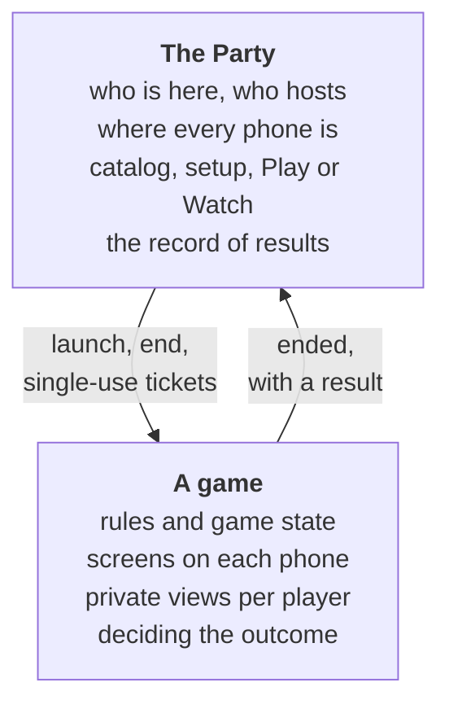
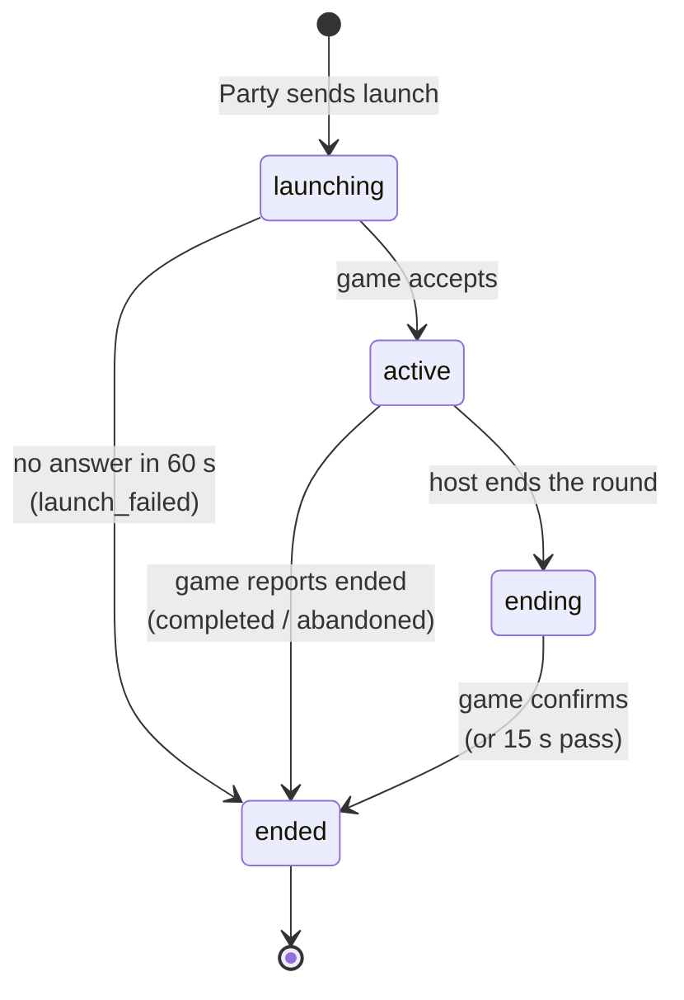

# How games integrate

A game in Avrana Party is a guest of the Party. The platform provides the people, the host,
the navigation and the lifecycle. The game provides the rules and the experience. This section
explains where that line runs and what a game has to do to sit on the right side of it.

!!! note "There is no SDK yet"

    Planned No game SDK, package format or installer
    exists, and no outside game has been integrated. The working examples are the project's own:
    **BLUFF** and **EXPO** (browser games whose server runs on the appliance), the **Gauntlet II**
    arcade stream, and a test-only **stand-in** for the isolated native-game path.
    [Building or porting a game today](../developers/starting-a-game.md) says what is realistic
    now, and [The reference games, explained](../developers/reference-games.md) walks through
    BLUFF and the stand-in.

## Who owns what

The game never learns a phone's long-term identity: only a per-session participant id.

## The integration points

A Party-integrated game touches the platform in a small number of well-defined places:

| Integration point | What the game provides | What the platform provides |
|---|---|---|
| **Catalog entry** | A *game contract*: id, name, player counts, how it relates to a TV, how it is presented, what it needs from a phone and from the appliance | The library, game detail pages and per-phone capability checks |
| **Grant** | Nothing. The **appliance** decides | Whether the game is installed, its entry point, trust tier and granted permissions |
| **Briefing** | Content as data: premise, rules and how-to-play sections (`onboarding.json`) | The setup screen, Play or Watch, and host-only Start |
| **Session** | Endpoints that accept a signed launch and end, ticket verification on WebSocket admission, a signed `ended` report | Launching, the roster, tickets, ending and result validation |
| **Navigation and host controls** | A place in its own interface for the host's End, Play again and Party Home buttons | Moving every phone to the right place, and telling the game who is host |
| **Results** | Optionally, a result in the versioned envelope | Validation and attribution, and in future a durable history |

These map onto the concrete mechanisms on the following pages:

- [Execution models](execution-models.md): the different kinds of game the appliance can run.
- [Contracts, catalog and grants](contracts-and-catalog.md): the declarations that tie games to
  the Party, and the CI that keeps them honest.
- [Native games and SDK status](native-games.md): the isolated native-game boundary, and the
  status of the SDK and the `.avrgame` package.
- [Designing for phones](designing-for-phones.md): what makes a good Avrana-native game.
- [Building or porting a game today](../developers/starting-a-game.md) and
  [The reference games, explained](../developers/reference-games.md): the practical side.

## What a game must not do

The ownership rule cuts both ways. Because the Party owns identity, presence, chat, the library,
navigation and durable results, the design documents ask new games **not** to build their own
login, profile store, chat, reconnect system, team system or spectator system. A game that
needs one of these should use the platform version, or contribute to it if it is missing.

Likewise, a game must not:

- accept identities that a client asserts for itself. In a Party session, players are
  admitted only with Party tickets;
- keep the Party's record of results, history or statistics. Games decide outcomes and report
  them;
- send any player another player's private state;
- navigate players out of the Party, or keep its own lobby between rounds.

## Appliance versus phone

Where work happens depends on the kind of game. The general principle in the architecture
documents is to **choose the cheapest viable place to run each part, per player**. They should
be chosen by capability, not by a fixed "mode".

| Responsibility | Browser-native game (BLUFF) | Streamed game (Gauntlet II) |
|---|---|---|
| Game rules and state | Appliance (authoritative game server) | Appliance (emulator) |
| Rendering | Phone (HTML and JavaScript) | Appliance renders and encodes; phone decodes video |
| Input | Phone, sent as game messages | Phone, sent as gamepad state 20 times a second |
| Private information | Filtered per viewer on the appliance and shown on that phone only | None: one shared picture for everyone |
| Audio | Phone | Appliance encodes; streamed to phones |
| Load on the appliance | Light | Heavy: emulator plus hardware video encode |

Browser-native games put most of the work on the phones and keep the appliance's job small:
being the authority. That is why they are the main path for new Avrana games. Streaming exists
for experiences that cannot run in a phone's browser, mainly emulated classics.

## The lifecycle a game experiences

From a game's point of view, every Party round follows the same shape, whatever the game does
internally:

During `active`, the game is in charge of its own screens and of the phones' viewport. Party
Home hides its own chrome entirely, apart from the host's controls, which appear inside the
game's interface. When a round completes, the game's own results screen stays up until the
host moves on. The game then receives `end` and releases the room.

[Game sessions](../architecture/game-sessions.md) has the full protocol view.
