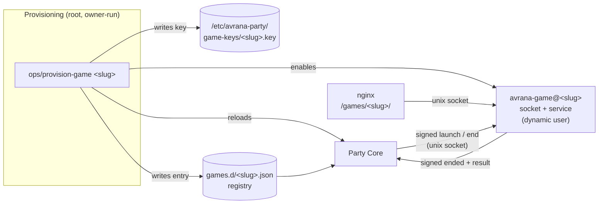

# Native games and packaging

An **Avrana-native game** is one written for this platform: browser clients on each phone, an
authoritative server on the appliance, and Party integration from the start. BLUFF is the first
in product terms. This page explains the boundary that native games are moving to, how far it
has got, and why the SDK and the package format have deliberately been left unfrozen.

## The boundary

Accepted direction
([ADR 0014](../decisions/0014-native-games-isolated-lan-games-retired.md))

Each native game is an **independent platform consumer**:

- **Its own process**, with its own service identity, secrets and state directory. A game reads
  no other game's state or keys. "Built-in" describes how much the game is trusted. It is not
  permission to share a process.
- **Local IPC over Unix sockets.** nginx and Party Core reach the game through its socket.
  Nothing the game serves is reachable except through the front door.
- **Generic routing from a registry.** Adding a game adds a registry entry and a grant. It
  never means editing nginx.
- **One provisioning path** creates the game's identity, grants, keys and registration. It is
  the same for every game.
- **No game-specific logic in Party Core.** The Party speaks the session protocol and the result
  envelope. It knows roles, the roster, the location and outcomes, never a game's rules or
  screens.
- **One active activity.** The appliance runs one Party doing one thing at a time. Idle games
  should cost nothing, so "runs only while active" is the expectation on a Raspberry Pi.

## What is built

In source · not deployed

All of these pieces are merged in the Party repository:

- a systemd **unit template** for native games, using socket activation, a dynamic user, a
  key passed in by systemd, a private state directory and Unix-socket networking only;
- a **registry directory** that Party Core reloads without restarting, and Unix-socket
  transport for the session protocol;
- a **generic nginx rule** that maps `/games/<slug>/` to that game's socket and refuses
  outside access to its control endpoints;
- **`ops/provision-game`**, which creates or rotates a game's key, writes its registry entry and
  unit configuration from the appliance grant, enables its socket and reloads Party Core. It
  can also remove a game;
- support for sending phones to a game's **own browser origin** when one is configured;
- a **test-only stand-in game** and a proof script that exercises the whole path on a CI runner
  with real systemd.

What is not done: no product game uses this path, the appliance has not been prepared for it,
and the provisioning runbook is labelled as a proposed procedure that has never run on the
appliance. Idle self-stop and resource ceilings are deferred to the Checkers work.

## The validation sequence

The project is deliberately proving the boundary with real games before generalizing it. The
roadmap sets the order:

1. **BLUFF**: the first Avrana-native vertical slice. It proved the Party, tickets, host
   navigation and the console model, while running inside the LAN Games fork.
2. **Checkers**: deliberately simple. It is the first game to live entirely outside the LAN
   Games runtime, launched and ended by Party Core as its own process. In review as of
   October 2026. Playing it on real phones on the appliance is a separate, later step.
3. **Spades**: the pressure test, covering teams, private hands, reconnect, scoring and richer
   results. A readiness packet and rule characterization tests exist. A Spades module already lives in the
   LAN Games donor library, and Checkers does too. The native versions that run outside it do not
   exist yet.
4. **Only then** freeze and build the SDK, the package format and the provider abstractions.

The reasoning is a common one: an SDK designed from one example encodes that example's
accidents. The project already had a near miss here. An earlier design document suggested that
the LAN Games session framework already *was* the SDK. ADR 0014 explicitly reversed that and
called the framework "a donor of patterns, not the SDK".

## The SDK

Planned. **No SDK exists.** The Party's protocol source
file says so in its own header. The unit template describes itself as "a field-test runtime
convention, not an SDK".

The intended role of an SDK is clear from the design documents. It would wrap the session
protocol (launch, ticket admission, end, results), the browser-side Party bridge and the
conventions for private per-player views. Then a game author would write rules and screens
instead of plumbing. Its surface will be designed after Checkers and Spades have shown what
actually repeats.

## The `.avrgame` package concept

Planned. **No implementation exists** in any repository,
not even a parser or a schema. `.avrgame` appears only in design documents and backlog issues.

The concept, from the project's open game installation design, is an installable package for
an Avrana game. Some principles around it are already
accepted:

- **No store.** The intended feel is *"Sure, install that weird GitHub project."* Install a
  package, add a trusted repository or a Git repository, sideload local content. No commercial
  marketplace, payments, reviews or DRM.
- **The package requests; the appliance grants.** A package describes what it needs. The
  appliance decides what it gets, through the same grant mechanism used today.
- **Signatures prove provenance, not safety.** Public-key signatures will say who published a
  package and that it has not changed. A signed package still runs inside the same process,
  identity and browser-origin boundaries as an unsigned one.
- **Trust tiers.** Built-in, trusted and community games are distinguished. Community code is
  expected to need a stronger sandbox tier, which has not been designed yet.

The archive format itself, dependency handling, the developer workflow and any community
repository are explicitly deferred until after the validation sequence above.

## If you want to build a native game today

[Building or porting a game today](../developers/starting-a-game.md) gives practical guidance on what you can do
now, and what to wait for.
