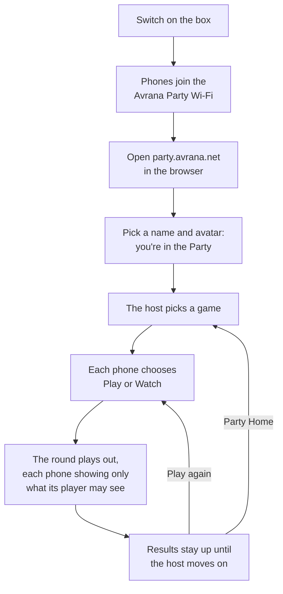

# Avrana Party

Avrana Party turns a Raspberry Pi into a self-contained multiplayer game system. Players join
its Wi-Fi, open a browser on their phones and play together. Nobody installs an app, signs up
for an account or needs a television, and the box does not need the internet.

"The game may change; the party does not."

That motto is the design. One **Party** (the people in the room, who is hosting and where
everyone should be) lasts all evening. Games come and go inside it, and every phone follows the
Party from one to the next.

## A party night

The first phone in becomes the **host**. If the host's phone goes away, the role passes on
automatically. Every step is implemented in source and tested with four simulated phones. The
deployed build has an older version of joining, setup and results.
[What Avrana Party is](introduction/index.md#a-party-night-step-by-step) walks through each
step.

## What works today

Avrana Party is a working prototype on one appliance, developed quickly by its owner with coding
agents. This site labels every capability by how far it has really got:

- Deployed The Party itself, BLUFF (a hidden-role card
  game) with Play or Watch, and an arcade game streamed to phones, all on the appliance and
  checked from the server side.
- In source A console-style Party model, a redesigned
  interface and the groundwork for isolated native games. These are merged and tested, but not
  verified as deployed.
- Accepted direction A degraded mode for when trusted
  HTTPS fails, separate browser origins for games, and separate service identities.

The next milestone is evidence rather than features: four people on four real phones finishing
a round offline. [What works today](status/index.md) has the full picture.

## Choose your path

-   :material-compass-outline: **New to Avrana Party**

    ---

    What it is, why it insists on phones alone, and what is real today.

    [What Avrana Party is](introduction/index.md) ·
    [Why phones, and only phones](introduction/phone-first.md)

-   :material-sitemap-outline: **Understanding the system**

    ---

    The components, their boundaries and the reasoning behind them.

    [Architecture overview](architecture/index.md) ·
    [The Party](architecture/party.md)

-   :material-gamepad-variant-outline: **Thinking about a game**

    ---

    How games plug in, the working examples, and what having no SDK yet means for you.

    [How games integrate](games/index.md) ·
    [Building or porting a game today](developers/starting-a-game.md)

Going further: [Developers](developers/index.md) covers setup and contributing,
[Reference](reference/index.md) holds every decision record and design document, and
[Project](project/roadmap.md) has the roadmap and deployment history.

!!! info "This site explains; the engineering repositories decide"

    This is a guided tour, not the specification. Every page ends with links to the canonical
    documents it explains. When this site and the engineering repositories disagree, the
    repositories are right. Nothing here grants permission to deploy or change a contract.
    [About this documentation](about/this-documentation.md) explains how the two stay in step.
