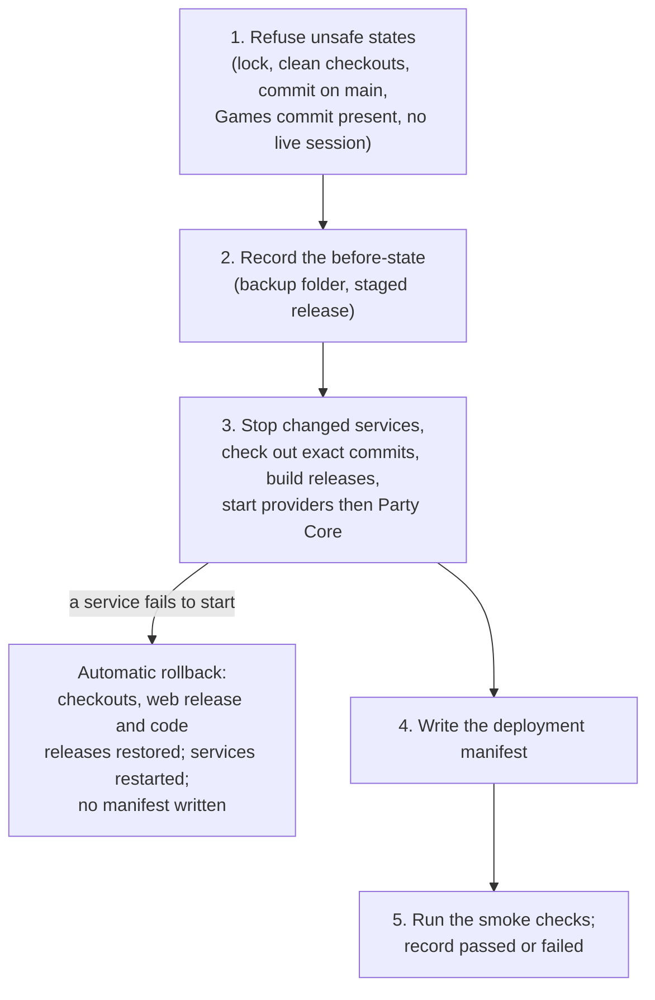

# Deployment

This page explains how a reviewed change is meant to get from the repositories onto the
appliance, and how anyone can then tell what is actually running there.

!!! danger "Explanation, not instructions"

    Production deployment is a **human decision and a human action**, taken by the owner.
    Nothing in CI, in an agent's task, in the engineering runbook or on this page authorizes
    it. A command in a runbook describes how a step is done; it is never permission to run it.

## Honest status

<span class="avr-badge source">In source</span> The deployment script (`ops/deploy.sh`), the
deployment manifest, the status endpoint and the smoke checks were merged on 2026-10-02 and
2026-10-03. As of the engineering runbook's last status line (2026-10-04), the script had **not
yet been run in production**, and no later record says it has. Every deployment recorded so far
was done with a one-off script written for that change and run by the owner; those are described
in the [system map](system-map.md#deployment-history).

The deployed builds recorded so far predate this tooling, so the appliance is not known to serve
the status endpoint or hold a manifest yet. The first run of the script is what would create
them.

Three distinctions run through everything here:

- **Merged is not deployed.** Source on `main` can be well ahead of the appliance.
- **Deployed is not phone-verified.** The script's checks are server-side. Real phones are a
  separate, human step (see [Testing](../developers/testing.md)).
- **A finding is a dated record.** It is evidence of what happened then, not a description of
  what is running now.

## Why a single deployment script

Before this work, each change was deployed by its own script, and the deployed revision lived in
people's memory, in dated findings and in a hand-edited table. The new design has three aims:

1. **One repeatable entry point.** The same script, with the same arguments, covers every routine
   deployment. It never chooses *what* to deploy: the operator names both commits explicitly.
2. **Forward, back and rollback are the same operation.** Each repository is checked out
   *detached* at exactly the named commit. No branch is moved or reset, so going back is simply a
   deployment of the earlier commits.
3. **The machine records what it runs.** After a deployment, the appliance writes a manifest of
   exactly what was deployed, and the Party serves a status document built from it.
   Documentation is updated *from* the appliance, never the other way round.

The original first-time installation runbooks (systemd units, keys, nginx, drop-in
configuration) remain the reference for setting a service up. A fresh machine has a separate
rebuild procedure, which is proposed but has never been run. The script covers the routine case:
everything is installed and a newer reviewed pair of commits should run.

## How a release is meant to reach the appliance

Before a deployment, both pull requests are merged and both repositories' CI is green, including
the cross-repository contract checks. The operator writes down the two full commit hashes, makes
sure the Games commit is present on the appliance, and makes sure no game is in progress.

The script is run on the appliance, as root, with a dry run first. The shape of the command is:

```sh
sudo bash ops/deploy.sh --party <40-character Party SHA> --games <40-character Games SHA> --dry-run
```

The **dry run** prints the plan (which checkouts move, which services restart, whether a new web
release is built). It only reads state and fetches from GitHub; it changes nothing and does not
need root.

A real run then works in five stages:



**1. Refuse unsafe states.** The script refuses to run alongside another deployment, on a
checkout with uncommitted changes, on a Party commit that is not on `origin/main`, when the Games
commit is missing, or while a game session is live (in setup, launching, active or ending). The
modified-checkout, off-`main` and live-session refusals each have an override flag, intended for
supervised use only.

**2. Record the before-state.** Before stopping anything, it stages the target Party release and
records the current revisions and web release in a timestamped backup folder.

**3. Stop, update, start.** It stops **only** the services whose code changes: Party Core and
the arcade when the Party commit changes, the games server when the Games commit changes. It
checks each repository out at its named commit, builds a root-owned code release of it under
`/opt` (what the services will run once they have their own users under
[ADR 0016](../decisions/0016-service-identities-and-local-trust-boundary.md); unused until then)
and installs a new web release of the Party shell. It starts the game providers first and Party
Core last, because the Party launches into them.

If any service does not come back, the script rolls itself back: both checkouts return to where
they were (without any force or hard reset, so nothing local is lost), the previous web release
and code releases are restored, services restart, and no manifest is written.

**4. Write the manifest.** See [below](#the-deployment-manifest).

**5. Smoke checks.** It runs the post-deployment checks and records `passed` or `failed` in the
manifest. A failed smoke run does **not** roll back automatically: the new code is running, and
the owner decides whether to fix forward or go back.

### What the script never touches

Keys, certificates, nginx, NetworkManager and systemd unit files and drop-ins are outside its
reach. Those remain owner steps in the first-time runbooks. One consequence is recorded
explicitly: since a change merged on 2026-10-03, the nginx site file and the Party shell must be
deployed together, because the shell offers exactly the games the site routes. The script
installs the shell but not the site file, so a deployment that crosses that change needs the
matching site file installed straight afterwards. Nothing checks this automatically.

### The first run on an older appliance

An appliance whose checkout predates the script has no copy of it to run. The runbook's answer is
to take the script from the target commit without moving the checkout, then run it as usual. The
script never runs its Python tooling from the checkout: it stages the target commit's release
first and runs the manifest and smoke tools from there. That first run also creates the `/opt`
release folders.

## The deployment manifest

The manifest (schema `avrana.deployment/v0`) is a small JSON file the script writes on the
appliance after services restart. It is **runtime-owned state**: the running appliance is the
authority on what it runs.

A moving Git tag was considered and rejected. A tag lives in the repository, not on the machine,
and says nothing about the Games checkout, the web release, uncommitted changes or whether the
checks passed.

The manifest records:

- when the deployment happened and the operator's login (never a secret);
- the exact Party and Games commits found in the production checkouts, whether either had
  modified or untracked files, and whether they are detached (the normal state after a
  deployment);
- the installed Party shell release;
- the contract versions the Party implements;
- which services the deployment restarted;
- which Party commit supplied the tooling, and the smoke result (`pending`, `passed`, `failed` or
  `skipped`).

Uncommitted changes are recorded, never hidden: the script refuses a modified checkout unless
explicitly overridden, and the manifest then says so. Each deployment also leaves a before-state,
an after-state and the smoke output in its backup folder.

The manifest is **not** deployment authorization, not phone acceptance and not a replacement for a
dated finding when something goes wrong. A manifest that says the smoke checks failed describes a
deployed system that failed its checks.

## The status endpoint

`GET /party/api/status` (schema `avrana.status/v0`) answers one question for a person or an
agent: *what exact Avrana build is running right now, and is it healthy?* It is served by Party
Core under the `/party/api/` path that nginx already forwards, so deploying a Party Core that
includes it is enough. No sign-in or cookie is needed. From a phone or laptop on the Party Wi-Fi:

```sh
curl -s https://party.avrana.net/party/api/status
```

The document combines several sources, in order of authority:

| Part | What it reports |
|---|---|
| Deployment | The manifest, minus file paths and the operator's login |
| Party and Games | The deployed commit against what is on disk now, with any mismatch or uncommitted change reported |
| Web release | The build and commit of the installed Party shell |
| Contract | The versions the Party implements, and what the games server advertises |
| Services | Each systemd unit: active, inactive, failed, not installed, unknown or unavailable |
| Certificate | Its expiry date, days left, and `expiring` below 21 days |
| Party Core, games, arcade | Live health from each service (members and current session, provider compatibility, emulator and stream state) |
| Summary | `ok`, `degraded` (with reasons) or `unknown` |

Two design choices matter for reading it:

- **Unknown is never reported as healthy.** If something cannot be observed (no manifest yet, a
  probe times out), the result is `unknown` or `unavailable`, not `ok`. Every probe has a timeout.
- **Optional is not missing.** The automatic certificate-renewal timer is not set up yet, so its
  absence is listed as a note rather than degrading the summary. If it is installed and failing,
  it degrades like any other unit.

The answer is cached for five seconds, so a room full of phones cannot turn it into a stream of
system queries. It **never** includes keys, tokens, cookies, environment variables, logs, phone
or peer addresses, request data, file paths or the operator's login; unit tests assert this.

Its consumers are the smoke checks, the Party's diagnostics page (which lets a person copy the
build into a field report), the drift-reconciliation tool, and agents, which read it to learn the
deployed version before changing code.

## The smoke checks

The smoke checks are a fixed, deterministic set. Each check passes, fails or is skipped, and a
skip is never counted as a pass. They change nothing on the appliance and touch no hardware. On
the appliance they check:

- the captive-portal probe on plain HTTP;
- Party Home, Party Core and the status document through the real HTTPS front door;
- the games server and the arcade on loopback, and, while the emulator is running, that the
  encoder has produced video within the last ten seconds;
- that each expected systemd unit is active (optional units excepted);
- the certificate's remaining validity;
- that the Party Wi-Fi's DNS answers for `party.avrana.net`.

A smaller subset runs against the local development server, so the checks themselves are tested
offline.

## After a deployment

The runbook's closing steps are human ones:

1. Read the status endpoint and confirm the summary is `ok` and the commits are the intended ones.
2. Move the work in Linear to review with a human-validation label while phone acceptance remains.
3. Do the physical check on real phones. Findings become new issues or close the current one.
4. Update the engineering system map from the manifest, and write a dated finding only when
   something noteworthy happened.

## Rollback

There are three levels, from the smallest to the largest:

- **Automatic, during a deployment.** If a service fails to start, the script restores the
  previous checkouts, web release and code releases and restarts services. Nothing is recorded as
  deployed.
- **The Party shell alone.** Web releases are kept side by side (the newest five), with a link
  pointing at the live one. The shell installer can switch the link back to the previous release
  without restarting any service.
- **A whole release.** Because every deployment is a detached checkout of named commits, going
  back is the same command with the earlier commit hashes. A failed smoke run prints exactly that
  command. After the first run, the production checkout is intentionally no longer "on `main`",
  and nobody should `git pull` in it.

Going back to a commit older than the tooling still works: the script uses the release that is
running for its tools, and says so. The smoke run will then fail on the status endpoint, which
that older commit does not serve, and the manifest records the failure.

Deployments before this script were rolled back by hand, in runbook order. The owner rehearsed one
such rollback and roll-forward of Party Core on 2026-09-29, and every check passed (see the
[system map](system-map.md#2026-09-29-morning-party-core-v0)).

## Game covers

Box art for games belongs to the owner and is never committed. It lives in one folder on the
appliance, and every web release copies whatever valid pictures it finds there (named after the
game, plain image files of at most 1 MB each). A file that fails these checks is left out and
reported, but never fails the install. Each release keeps the covers it was built with, so rolling
the shell back restores the old covers too, whereas deploying an earlier commit takes the folder as
it is now. Changing a cover needs only a new web release, with no service restart.
