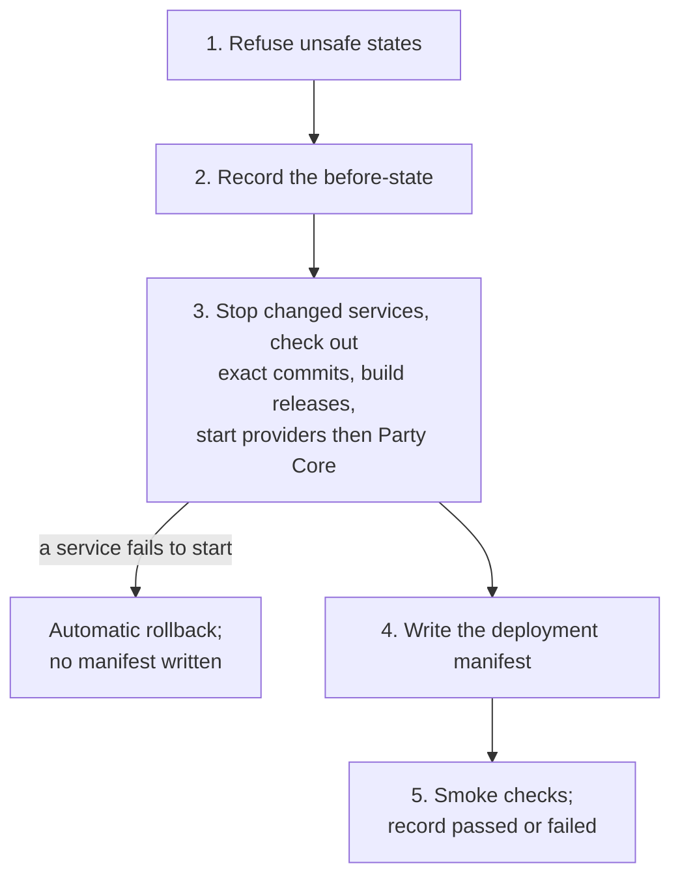

# Deployment

This page explains how a reviewed change is meant to get from the repositories onto the
appliance, and how anyone can then tell what is running there.

!!! danger "Explanation, not instructions"

    Production deployment is a **human decision and a human action**, taken by the owner.
    Nothing in CI, in an agent's task, in the engineering runbook or on this page authorizes
    it. A command in a runbook describes how a step is done; it is never permission to run it.

## Honest status

<span class="avr-badge source">In source</span> The deployment script (`ops/deploy.sh`), the
deployment manifest, the status endpoint and the smoke checks were merged on 2026-10-02 and
2026-10-03. As of the runbook's status line (2026-10-04) the script had **not yet been run in
production**, and no later record says it has. Every recorded deployment used a one-off script
written for that change and run by the owner (see the
[deployment history](system-map.md#deployment-history)). Those builds predate this tooling, so
the appliance is not known to hold a manifest or serve the status endpoint yet.

Three distinctions run through everything here: **merged is not deployed**, **deployed is not
phone-verified** (see [Testing](../developers/testing.md)), and **a dated finding records what
happened then**, not what is running now.

## Why one script

Before this work the deployed revision lived in people's memory, in dated findings and in a
hand-edited table. The new design aims for:

- **One repeatable entry point** that never chooses *what* to deploy: the operator names both
  the Party and the Games commit explicitly.
- **Forward, back and rollback as one operation.** Each repository is checked out *detached* at
  exactly the named commit. No branch is moved or reset, so going back is simply deploying the
  earlier commits.
- **The machine recording what it runs**, so documentation is updated *from* the appliance and
  never the other way round.

The first-time installation runbooks (units, keys, nginx, drop-in configuration) still cover
setting a service up. The script covers the routine case: everything is installed and a newer
reviewed pair of commits should run.

## How a release reaches the appliance

Beforehand, both pull requests are merged with CI green in both repositories, including the
cross-repository contract checks; the Games commit is present on the appliance; and no game is in
progress. The owner then runs the script on the appliance, a dry run first. Its shape is:

```sh
sudo bash ops/deploy.sh --party <full Party SHA> --games <full Games SHA> --dry-run
```

The dry run only reads state and fetches from GitHub, then prints the plan: which checkouts move,
which services restart, whether a new web release is built. A real run continues:



1. **Refuse unsafe states**: another deployment running, a checkout with uncommitted changes, a
   Party commit not on `origin/main`, a missing Games commit, or a game session in progress.
   Three of these (uncommitted changes, an off-`main` commit, a live session) have override flags
   meant for supervised use only.
2. **Record the before-state** in a timestamped backup folder, before stopping anything.
3. **Stop, update, start.** Only the services whose code changes are stopped: Party Core and the
   arcade for a Party change, the games server for a Games change. Each repository is checked out
   at its commit, a root-owned code release is built under `/opt` (what the services will run once
   they have their own users under
   [ADR 0016](../decisions/0016-service-identities-and-local-trust-boundary.md); unused until
   then) and a new web release of the Party shell is installed. Game providers start first and
   Party Core last, because the Party launches into them. If a service does not come back, the
   script puts the checkouts, web release and code releases back as they were, without any force
   or hard reset, and restarts the services.
4. **Write the manifest** (below).
5. **Run the smoke checks** and record the result. A failed smoke run does **not** roll back by
   itself: the new code is running, and the owner decides whether to fix forward or go back.

The script never touches keys, certificates, nginx, NetworkManager or systemd unit files. One
consequence is recorded explicitly: since a change merged on 2026-10-03, the nginx site file and
the Party shell must be deployed together, because the shell offers exactly the games the site
routes. The script installs only the shell, so a deployment crossing that change needs the
matching site file installed straight afterwards, and nothing checks this.

An appliance whose checkout predates the script has no copy of it. The runbook's answer is to
take the script from the target commit without moving the checkout. The script never runs its
tooling from the checkout anyway: it stages the target release first and runs the manifest and
smoke tools from there.

## The deployment manifest

The manifest (`avrana.deployment/v0`) is a small JSON file the script writes on the appliance
after services restart. It is **runtime-owned state**: the running appliance is the authority on
what it runs. A moving Git tag was considered and rejected, because a tag lives in the repository,
not on the machine, and says nothing about the Games checkout, the web release, uncommitted
changes or whether the checks passed.

It records when the deployment happened and the operator's login; the exact Party and Games
commits in the production checkouts, with any modified or untracked files; the installed shell
release; the contract versions; the services restarted; and the smoke result. Uncommitted changes
are recorded, never hidden. Each deployment also keeps before and after copies and the smoke
output in its backup folder.

The manifest is **not** deployment authorization, not phone acceptance and not a replacement for
a dated finding when something goes wrong.

## The status endpoint

`GET /party/api/status` (`avrana.status/v0`) answers one question for a person or an agent:
*what exact Avrana build is running right now, and is it healthy?* Party Core serves it under the
path nginx already forwards, and no sign-in is needed. From the Party Wi-Fi:

```sh
curl -s https://party.avrana.net/party/api/status
```

It reports:

| Part | What it says |
|---|---|
| Deployment | The manifest, without file paths or the operator's login |
| Party and Games | The deployed commit against what is on disk now, flagging any mismatch or uncommitted change |
| Web release and contract | The installed shell's build, the contract versions, and what the games server advertises |
| Services | Each systemd unit: active, inactive, failed, not installed, unknown or unavailable |
| Certificate | Days left; `expiring` below 21 days |
| Party Core, games, arcade | Live health: members and session, provider compatibility, emulator and stream state |
| Summary | `ok`, `degraded` with reasons, or `unknown` |

**Unknown is never reported as healthy**: if something cannot be observed, it says so. The
automatic certificate-renewal timer is not set up yet, so its absence appears as a note rather
than a fault. The answer is cached for five seconds, so a room full of phones cannot flood the
system with queries. It **never** includes keys, tokens, cookies, environment variables, logs,
phone addresses, request data, file paths or the operator's login, and unit tests assert this.

Its consumers are the smoke checks, the Party's diagnostics page (which lets a person copy the
build into a field report), the drift-reconciliation tool, and agents learning the deployed
version before changing code.

## The smoke checks

A fixed set of checks, each passing, failing or skipped, where a skip never counts as a pass. They
change nothing and touch no hardware. On the appliance they cover the captive-portal probe; Party
Home, Party Core and the status document through the real HTTPS front door; the games server and
the arcade on loopback, including recent video while the emulator runs; each expected systemd
unit; the certificate; and the Party Wi-Fi's DNS answer for `party.avrana.net`.

## After a deployment

The closing steps are human: confirm the status summary is `ok` with the intended commits; mark
the Linear work as awaiting human validation while phone acceptance remains; check on real
phones; and update the engineering system map from the manifest, adding a dated finding only when
something noteworthy happened.

## Rollback

- **Automatic, during a deployment**, when a service fails to start (step 3 above).
- **The Party shell alone.** The newest five web releases are kept side by side behind a `current`
  link, and the shell installer can switch the link back without restarting any service.
- **A whole release.** Going back is the same command with the earlier commits, which a failed
  smoke run prints. After the first run the production checkout is intentionally detached, and
  nobody should `git pull` in it. Going back to a commit older than the tooling works too, but its
  smoke run fails because that commit does not serve the status endpoint.

Deployments before this script were rolled back by hand. The owner rehearsed a full rollback and
roll-forward of Party Core on 2026-09-29, and every check passed (see
[the system map](system-map.md#2026-09-29-morning-party-core-v0)).

## Game covers

The owner's box art is never committed. It lives in a folder on the appliance, and each web
release copies the valid pictures it finds there; anything else is left out with a message,
never failing the install. A release keeps the covers it was built with, and changing a cover
needs only a new web release, with no service restart.
